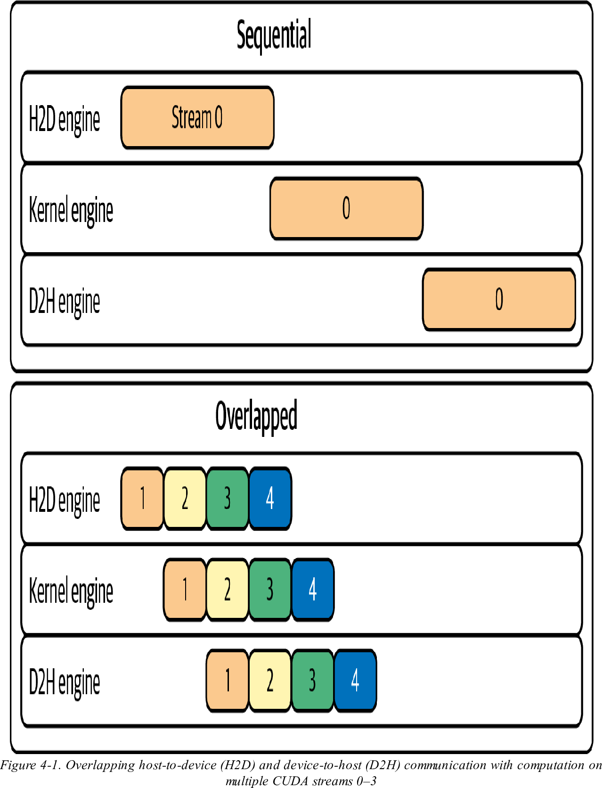
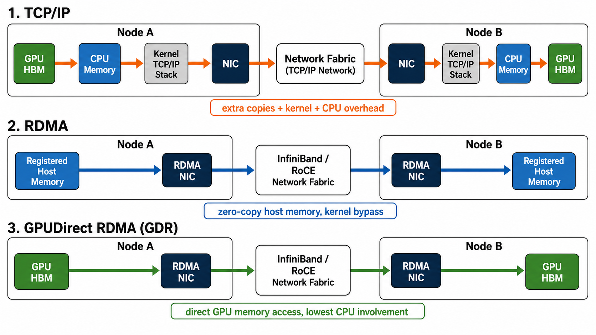
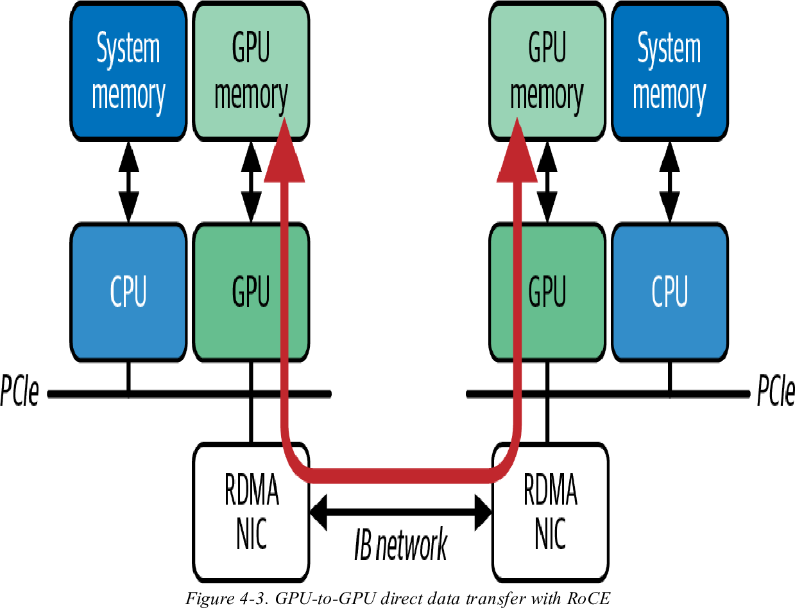
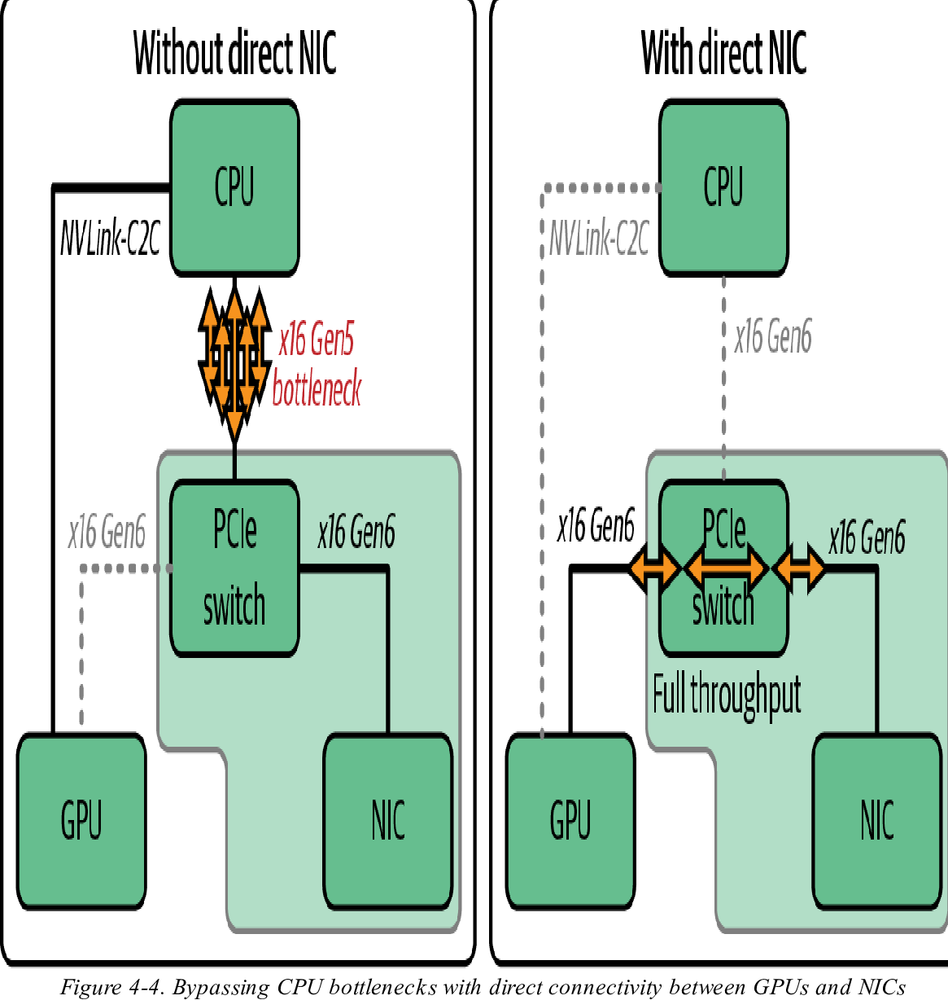
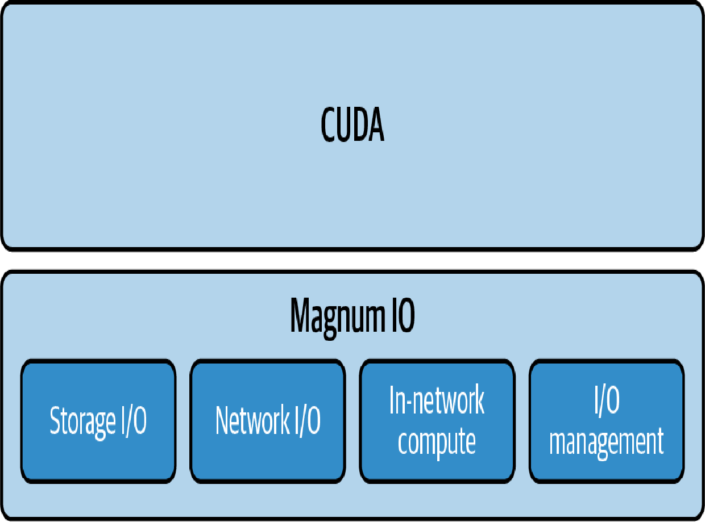

## 本章概要

分布式 AI 系统的核心瓶颈经常不是 GPU 算得慢，而是 GPU 在等数据。训练时，梯度、参数分片和激活值需要在多张 GPU 之间同步；推理时，KV cache、请求状态和模型分片需要在不同 worker 之间移动。规模越大，通信路径、同步时机和网络拓扑越影响整体吞吐。

本章重点保留三条主线。第一，建立通信优化的基本判断：什么时候是框架通信模式的问题，什么时候该减少同步频率或传输数据量，什么时候该把通信隐藏在计算背后。第二，理解 RDMA 和 GPUDirect RDMA 为什么能绕过慢路径。第三，理解 NCCL 如何建立在 NVLink、NVSwitch、InfiniBand/RoCE、SHARP 等 NVIDIA 通信栈之上，完成训练中的 all-reduce、reduce-scatter 和 all-gather。

---

## 章节详解

### 1. 通信优化的基本判断

通信优化先看一个问题：**GPU 是在计算，还是在等通信**。如果 GPU 大部分时间在跑 kernel，通信优化收益有限；如果 timeline 中有明显的 all-reduce、copy、socket 或 network wait，通信路径和同步策略就会成为主要瓶颈。

这一节先按现象建立判断框架。看到 GPU 等待后，不要直接套环境变量模板，而是先判断等待来自框架通信模式、同步频率、传输数据量、跨节点路径，还是 collective 拓扑。不同现象对应的优化手段不同。

| 现象 | 可能原因 | 优先考虑的优化 | 直觉 |
| --- | --- | --- | --- |
| 单机多卡时 GPU0 更忙，其他 GPU 等待 | 使用 `DataParallel`，主 GPU 负责聚合 | 换成 `DistributedDataParallel` | 避免 GPU0 聚合瓶颈，让 NCCL 负责同步 |
| backward 结束后出现一大段 all-reduce | 梯度同步启动太晚 | DDP bucket、CUDA streams、通信计算重叠 | 边算边同步，减少 GPU 空转 |
| 每个 step 都有固定同步开销 | 同步频率太高 | 梯度累积 | 多个 micro-batch 后再同步一次 |
| 网络链路持续打满，GPU 等通信 | 每次传输数据量太大 | 梯度压缩、量化、稀疏化 | 少传数据，但要关注收敛影响 |
| all-reduce 时 CPU 很忙，GPU 通信慢 | 后端误用 Gloo 或 socket 路径 | 使用 NCCL，并确认走 GPU 通信路径 | GPU collective 不应主要靠 CPU 搬数据 |
| 跨节点吞吐远低于预期 | NCCL 走 TCP 或 CPU staging 慢路径 | RDMA / GPUDirect RDMA | 让 NIC 直接访问注册内存或 GPU HBM |
| GPU 数量增加后 all-reduce 扩展性变差 | collective 没有匹配硬件拓扑 | NCCL 拓扑感知、SHARP、NVLS | 让节点内、节点间和网络内计算各走合适路径 |
| 某个 rank 经常拖慢整轮迭代 | straggler、NUMA 绑定不当或网络局部拥塞 | 检查 rank 级 timeline、CPU affinity 和网卡计数器 | collective 的总耗时由最慢参与者决定 |
| 分离式推理中 decode 等 KV cache | KV cache 点对点迁移成为瓶颈 | NIXL | 大块点对点数据异步移动 |

下面沿着这些现象展开。

**框架通信模式问题。** 单机多卡训练中，如果仍在使用 `DataParallel`，GPU0 往往会更忙。`DataParallel` 是单进程控制多张 GPU，主 GPU 负责 scatter 输入、gather 输出和聚合梯度，容易形成主卡瓶颈。`DistributedDataParallel` 通常是一进程一 GPU，用 NCCL 做梯度 all-reduce，并在 backward 过程中按 bucket 发起异步通信，因此更适合多 GPU 训练。

**通信启动太晚。** 数据并行训练中，每张 GPU 持有一份模型副本，处理不同 mini-batch，backward 后需要同步梯度。朴素做法是所有 backward 结束后再统一 all-reduce，这会把通信时间直接加到每轮迭代上。更好的做法是把梯度切成 bucket，某个 bucket 一准备好就发起 NCCL all-reduce，同时继续计算后续层的梯度。

<Frame caption="通信与计算重叠：同步模式会让 GPU 等待 all-reduce；DDP bucket 可以在 backward 过程中提前启动通信">
  
</Frame>

需要避免的常见同步点包括 `torch.cuda.synchronize()` 和 `tensor.item()`。前者会等待当前设备上的工作全部完成，后者会把 GPU 标量搬回 CPU，也可能触发同步。计时或日志统计应尽量放在迭代末尾，避免打断重叠流水线。

**同步频率太高。** 如果每个 step 都有固定通信开销，可以用梯度累积减少同步次数。多个 micro-batch 先在本地累积梯度，再做一次 all-reduce，相当于用更多本地计算换更少的跨 GPU 同步。代价是有效 batch size 变大，可能需要重新调学习率和内存预算。

**传输数据量太大。** 如果网络链路持续打满，压缩、量化或稀疏化可以减少每次通信的数据量。这类方法直接作用在“传多少”上，但会改变梯度信息，需要关注收敛稳定性和最终精度。

**跨节点路径太慢。** 如果跨节点吞吐远低于预期，先确认通信后端是否正确。GPU 训练应优先使用 NCCL；如果误用 Gloo，或者 NCCL 因配置问题退回 socket/TCP，通信就会变成 CPU 和内核网络栈主导。RDMA 和 GPUDirect RDMA 解决的是数据路径问题，下一节单独展开。

**collective 拓扑不匹配。** 如果 GPU 数量增加后 all-reduce 扩展性变差，问题可能不在单条链路，而在 collective 算法和硬件拓扑没有匹配。还要检查是否存在 straggler：一个 rank 的 CPU 线程、网卡或远端内存访问变慢，就会拖住整个 collective。NCCL、NVLink/NVSwitch、InfiniBand/RoCE、SHARP 和 NVLS 属于第三节的重点。

实践中的第一步仍然是看 profiler。Nsight Systems 或 PyTorch profiler 里如果看到计算和通信串行排列，就先检查 DDP bucket、同步点和通信后端；如果通信已经被计算覆盖，再继续调 NCCL 算法或网络参数，收益通常会变小。

### 2. RDMA 与 GPUDirect RDMA

RDMA 解决的是跨节点数据传输路径过长的问题。普通 TCP/IP 通信通常需要数据经过 CPU 内存和内核网络栈，带来多次拷贝、上下文切换和 CPU 开销。RDMA 让网卡直接读写远端已注册内存，绕开内核数据路径；GPUDirect RDMA 进一步让网卡直接访问 GPU 显存。

<Frame caption="TCP/IP、RDMA 与 GPUDirect RDMA 的数据路径对比：越往下，CPU 和内核网络栈参与越少">
  
</Frame>

<Frame caption="GPUDirect RDMA：RDMA NIC 直接读写远端 GPU memory，避免数据经过 host CPU 和 system memory 中转">
  
</Frame>

三条路径可以这样理解：

| 路径 | 数据怎么走 | 适用直觉 |
| --- | --- | --- |
| **普通 TCP/IP** | GPU -> CPU 内存 -> kernel TCP/IP -> NIC -> 网络 -> NIC -> CPU 内存 -> GPU | 兼容性最好，但多拷贝、CPU 参与多 |
| **RDMA** | 应用内存 -> NIC -> 网络 -> NIC -> 远端应用内存 | 绕过内核数据路径，降低延迟和 CPU 开销 |
| **GPUDirect RDMA** | GPU HBM -> NIC -> InfiniBand/RoCE -> NIC -> GPU HBM | 多节点 GPU 训练和推理的关键快路径 |

对 AI 训练来说，RDMA 的价值不只是“网络更快”，而是减少 CPU 参与，让 GPU 间大块数据传输更接近硬件极限。多节点 DDP、FSDP、张量并行、专家并行都会受益，尤其是梯度或参数分片很大时。

容器和 Kubernetes 环境中最容易出现“看起来能跑，但其实走慢路径”的问题。常见原因包括 `/dev/infiniband` 没有暴露给容器、`nvidia_peermem` 没加载、GID/权限不匹配、NCCL 选错网卡，或者 RoCE 网络没有正确配置。结果是 NCCL 悄悄退回 socket/TCP，吞吐明显下降，但业务代码不一定报错。

<Frame caption="直接连接 NIC 可以绕过 CPU 到 PCIe switch 的瓶颈，让 GPU 与 NIC 之间获得更完整的链路吞吐">
  
</Frame>

验证时看四类信号：

- `lsmod | grep nvidia_peermem`：确认 GPUDirect RDMA 相关模块已加载。
- `NCCL_DEBUG=INFO`：确认日志中出现 `NET/IB`，而不是只走 socket。
- RDMA perftest：使用 GPU buffer，例如带 `--use_cuda` 的测试。
- Nsight Systems / 网卡计数器：确认网络传输和 GPU 计算能够并行发生。

### 3. NCCL 与 NVIDIA 通信栈

NCCL 是训练侧最重要的 GPU collective 通信库。PyTorch DDP、FSDP、Megatron、Horovod 等框架中的 all-reduce、reduce-scatter、all-gather、broadcast，通常都由 NCCL 在底层完成。

NCCL 不单独存在，它位于 NVIDIA Magnum IO 通信栈里。Magnum IO 把存储 I/O、网络 I/O、网络内计算和 I/O 管理放在同一套性能优化框架下：NCCL 负责 collective，GPUDirect RDMA 负责跨节点 GPU 数据路径，SHARP/NVLS 负责把部分 reduction 下沉到网络或 NVSwitch fabric。

<Frame caption="Magnum IO 把 storage、network、in-network compute 和 I/O management 组合成 NVIDIA 的 I/O 加速栈；NCCL 属于其中的 Network I/O / collective 通信路径">
  
</Frame>

NCCL 的性能来自两层能力：上层是 collective 算法，下层是 NVIDIA 通信栈。

| 层次 | 组件 | 作用 |
| --- | --- | --- |
| Collective 算法 | Ring、Tree、CollNet、PAT | 根据消息大小和 GPU 数量组织通信 |
| 节点内互联 | NVLink、NVSwitch、NVLS | 提供 GPU 间高带宽低延迟链路 |
| 跨节点互联 | InfiniBand、RoCE、GPUDirect RDMA | 让 GPU 跨服务器高速交换数据 |
| 网络内计算 | SHARP | 在交换机中做部分 reduction，降低端点压力 |
| 管理与诊断 | NCCL 日志、拓扑文件、UFM/NetQ、Nsight Systems | 验证链路、算法和瓶颈 |

最典型的 collective 是梯度 all-reduce。每张 GPU 先算出本地梯度，然后 collective 让所有 GPU 得到全局平均梯度。Ring all-reduce 会把梯度切块，每张 GPU 只和相邻 GPU 通信，通过 reduce-scatter 和 all-gather 两个阶段完成同步。

不同算法适合不同场景：

| 算法 | 适合场景 | 直觉 |
| --- | --- | --- |
| **Ring** | 大消息、高带宽场景 | 把大张量切块，持续喂满链路 |
| **Tree** | 小消息、低延迟场景 | 通信步数少，启动快 |
| **CollNet / CollTree** | 多节点训练 | 节点内和节点间分层通信 |
| **PAT** | 大规模 collective | 兼顾 tree 的低延迟和 ring 的带宽利用 |
| **SHARP / NVLS** | 支持网络内计算的硬件 | 把部分 reduction 下沉到交换设备或 NVSwitch fabric |

大多数时候，NCCL 的自动选择已经足够好。手动设置 `NCCL_ALGO`、`NCCL_PROTO` 之前，先用日志和 profiler 确认默认选择确实有问题。更常见、更实际的排障是确认 NCCL 是否选对网卡、是否走 RDMA、是否识别到 NVLink/NVSwitch 拓扑。

常用排查入口：

| 目标 | 工具 / 环境变量 |
| --- | --- |
| 查看初始化、拓扑和网络路径 | `NCCL_DEBUG=INFO` |
| 聚焦网络和 collective | `NCCL_DEBUG_SUBSYS=INIT,NET,COLL` |
| 指定网卡，避免走错接口 | `NCCL_SOCKET_IFNAME=<iface>` |
| 验证 RDMA 路径 | NCCL 日志、RDMA perftest、网卡计数器 |
| 看通信是否覆盖计算 | Nsight Systems timeline |

调优 NCCL 时不要把环境变量当作固定模板。先回答三个问题：通信是否真的成为瓶颈，NCCL 是否走了最快链路，collective 是否已经和计算重叠。只有这些问题有明确证据后，算法和环境变量调优才有意义。

还有两个生命周期原则值得保留。第一，不要在每个 step 里创建和销毁 NCCL communicator；初始化和拓扑发现应放在训练或服务启动阶段，并在生命周期内复用。第二，不要忽略 NCCL warning。很多 warning 指向的不是“日志噪音”，而是版本不匹配、端口耗尽、网络 fallback、异步错误或 rank 卡死。

### 4. 其他通信组件

NIXL 和 GDS 本章只需要建立概念。NIXL 面向分布式推理中的点对点大块数据传输，典型场景是 prefill/decode 分离后迁移 KV cache。GDS 面向 GPU 与 NVMe 存储之间的数据路径，更多属于下一章存储 I/O 优化。

---

## 核心要点

### 核心思想：先判断等待在哪里

1. 如果 GPU 在等 backward 后的梯度同步，优先看 DDP、bucket 和通信计算重叠。
2. 如果跨节点通信慢，优先确认 RDMA / GPUDirect RDMA 是否走通。
3. 如果 collective 放大到多节点，重点看 NCCL 是否正确利用 NVLink、NVSwitch、InfiniBand/RoCE、SHARP 等通信栈。
4. 如果只有少数 rank 慢，按 straggler 排查 CPU affinity、NUMA、网卡和远端内存访问。

## FAQ

<Accordion title="正常通信和 RDMA 的核心区别是什么？">
普通 TCP/IP 路径通常需要 CPU 内存和内核网络栈参与。RDMA 让 NIC 直接访问注册内存，GPUDirect RDMA 进一步让 NIC 直接读写 GPU HBM。
</Accordion>

<Accordion title="为什么 DDP 通常比 DataParallel 更适合训练？">
DDP 一般是一进程一 GPU，使用 NCCL all-reduce 同步梯度，并能在 backward 过程中按 bucket 异步通信。DataParallel 由单进程控制多 GPU，主 GPU 聚合容易成为瓶颈。
</Accordion>

<Accordion title="NCCL 调优先看什么？">
先看 `NCCL_DEBUG=INFO` 和 Nsight Systems。确认 NCCL 是否走了正确网卡、是否使用 RDMA、是否识别 NVLink/NVSwitch，以及通信是否已经和计算重叠。
</Accordion>
