## 本章概要


CUDA 性能优化需要把 GPU 架构、CUDA 编程模型、内存体系和性能分析方法串联起来。CPU 更追求单线程低延迟，而 GPU 更追求大量线程同时执行的吞吐量；SM、warp scheduler、SIMT 执行模型，以及 thread、warp、block、grid 这些 CUDA 线程层级，是理解 CUDA kernel 执行方式的基础；`threadsPerBlock` 和 `blocksPerGrid` 的选择、线程块大小使用 32 的倍数、kernel 中的边界检查，决定了并行任务能否正确映射到 GPU；register、shared memory / L1、L2、HBM、TMEM、TMA、Unified Memory、异步内存分配和 memory pool，则决定了数据移动成本。occupancy、launch bounds、CUDA Occupancy API、Compute Sanitizer、Roofline 模型、Nsight Systems、Nsight Compute 和 NVTX 可以帮助判断一个 CUDA kernel 是并行度不足、资源受限、内存受限还是计算受限。高性能 CUDA 编程的关键，是让 GPU 有足够多的有效并行工作，同时让数据尽可能靠近计算单元，并用 profiling 工具验证每一次优化是否真正解决了瓶颈。

## 章节详解


## 第二部分：章节详解

### 1 GPU 架构与 CUDA 的执行

GPU 架构基础围绕三个问题展开：GPU 为什么快，SM 和 warp scheduler 如何工作，以及 CUDA 为什么要用 thread、warp、block、grid 这样的层级来组织并行任务。

#### 1.1 GPU 为什么快：吞吐量优先，而不是单线程优先

理解 GPU 性能优化，需要先区分 CPU 和 GPU 的设计目标。CPU 的设计更偏向“尽快完成一个复杂任务”，它依赖较强的单线程性能、复杂的分支预测、乱序执行和大缓存，因此适合执行控制流复杂、线程数量不多、每一步逻辑差异较大的任务。

GPU 的设计目标不同。GPU 不是为了让某一个线程执行得特别快，而是为了让成千上万个线程同时工作。它更像一个吞吐量机器：只要任务可以拆成大量相似的小任务，GPU 就能把这些小任务分发给大量线程并行处理。

可以这样概括：

> GPU 的快，不在于单个线程跑得快，而在于同时运行的线程足够多。它依靠大规模并行和 warp 间快速切换来隐藏等待时间。

CUDA 的基本执行流程展示了 CPU 和 GPU 如何配合：

<Frame caption="CUDA 基本执行流程：CPU 准备数据、拷贝到 GPU、启动 kernel、执行、拷贝回 CPU">
  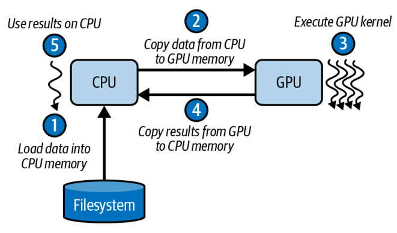
</Frame>


1. CPU 端准备数据。
2. 数据从 CPU memory 拷贝到 GPU memory。
3. CPU 启动 GPU kernel。
4. GPU 在 device 上执行 kernel。
5. 执行结束后，结果从 GPU memory 拷贝回 CPU memory。

这一流程说明，GPU 程序的性能问题不一定只来自 kernel 本身，也可能来自 CPU-GPU 数据传输，或者来自数据传输和计算没有重叠。`cudaMemcpyAsync`、pinned memory、Nsight Systems 时间线等内容，都与这一问题相关。

#### 1.2 SM、warp scheduler 与执行流水线

|               | V100 (2017) | A100 (2020)   | H100 (2022) | B200 (2024) |
| :------------ | :---------- | :------------ | :---------- | :---------- |
| 制程            | 12nm        | 7nm           | 4nm         | 4nm         |
| Tensor Core   | 第1代         | 第3代           | 第4代         | 第5代         |
| 标志性精度         | FP16        | TF32 + BF16   | FP8         | FP4         |
| 内存            | 16GB HBM2   | 40/80GB HBM2e | 80GB HBM3   | 180GB HBM3e |
| 内存带宽          | 900 GB/s    | 1.55 TB/s     | 3.35 TB/s   | ~8 TB/s     |
| NVLink        | 300 GB/s    | 600 GB/s      | 900 GB/s    | 1.8 TB/s    |
| 计算能力          | 7.0         | 8.0           | 9.0         | 10.0        |
| **CUDA_ARCH** | **700**     | **800**       | **900**     | **1000**    |

- GPU Device
	- Streaming Multiprocessor (SMs)
		- CUDA Cores
		- Special Function Units (SFU)
		- Register File
		- Shared Memory / L1 Cache
		- Texture Units / Load/Store Units
		- Warp Scheduler
		- Dispatch Unit
	- Memory Hierarchy
		- Global Memory（HBM2/HBM3）
		- L2 Cache
		- L1 Cache / Shared Memory
		- Registers
	- Interconnect
		- NVLink / NVSwitch

Blackwell 中 SM 的组织方式和 warp 调度机制，是理解现代 NVIDIA GPU 执行模型的重要入口。

GPU 由许多 SM 组成，SM 全称是 Streaming Multiprocessor。SM 可以暂时理解为 GPU 上的“计算单元”，但它不是 CPU core 的简单放大版。CPU core 更强调单线程执行能力，而 SM 更强调同时容纳和调度大量线程。

<Frame caption="Blackwell SM 内部结构：warp scheduler、CUDA cores、寄存器和共享内存等组件">
  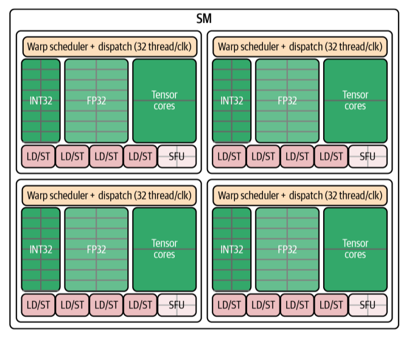
</Frame>

以 Blackwell 为例：

- 每个 SM 最多可以跟踪 64 个 warp。
- 一个 warp 是 32 个线程。
- 因此每个 SM 最多可以同时维护 2048 个线程。
- 每个 SM 有 64K 个 32-bit registers，总共约 256 KB。
- 每个 SM 还有统一的 L1 cache / shared memory 空间，其中最多约 228 KB，可用约 227 KB，可以配置为用户管理的 shared memory。

SM 需要维护大量 warp，是因为 GPU 访问 global memory 的延迟很高。如果一个 warp 发起内存访问后原地等待，SM 就会空转。GPU 的做法是：当某个 warp 等待内存时，warp scheduler 会切换到另一个 ready warp 继续执行。只要活跃 warp 足够多，SM 就能持续保持忙碌。

Blackwell SM 内部有多个 warp scheduler。一个 SM 可以看作由多个调度分区组成，每个分区有自己的 warp scheduler 和 dispatch logic。理想情况下，四个 scheduler 每个周期可以从四个不同 warp 中各发射一条指令。

可以用如下类比理解：

> 一个 SM 像一个车间，warp scheduler 像调度员。哪个 warp 的数据准备好了，调度员就让它进入流水线；哪个 warp 在等待内存，就先暂停，让其他 ready warp 补上。

此外，每个调度器还支持双发射，能够为同一 warp 发出两条独立指令（例如，一条算术指令和一条内存操作）。注意，双发射必须来自同一 warp，而不能跨越不同 warp。

具体理解如下：

- 如果一个 warp 只有计算，没有内存操作，可能只使用计算流水线。
- 如果一个 warp 只有内存操作，可能计算流水线处于空闲。
- 如果同一个 warp 有可配对的计算和访存操作，就可能同时使用 math pipeline 和 memory pipeline，从而提高硬件利用率。

还有特殊函数单元 SFU，也就是 Special Function Unit。SFU 用于处理 `sin`、`cos`、倒数、平方根等特殊函数。SFU 拥有独立流水线，不属于普通 math + memory 的 dual issue 配对。这个细节说明 GPU 内部并不是单一计算单元，而是包含 INT32、FP32、Tensor Core、LD/ST、SFU 等多种执行管线。


 GPU 架构层面的关键，是 SM 能同时维护大量 warp，并通过 warp scheduler 把 ready warp 持续送入不同流水线执行。occupancy 本质上就是讨论如何让 SM 有足够多的 warp 可以调度。

#### 1.3 SIMT、warp 与分支发散

SIMT 是 Single Instruction, Multiple Threads，即单指令多线程。CUDA 程序员写的是 thread 级代码，看起来每个线程都在独立运行；但在硬件层面，GPU 会把 32 个线程组成一个 warp。warp 是实际的硬件执行单位，同一个 warp 中的 32 个线程通常一起执行同一条指令，只是处理的数据不同。

例如这个 kernel：

```cpp
int idx = blockIdx.x * blockDim.x + threadIdx.x;
if (idx < N) {
    input[idx] *= 2.0f;
}
```

每个线程都执行同一段代码，但 `threadIdx.x` 不同，因此每个线程算出的 `idx` 不同，处理的数组元素也不同。这就是 GPU 适合数据并行任务的原因：同一条指令作用在大量不同数据上。

SIMT 也带来一个问题：warp 内线程最好走相同控制流。如果同一个 warp 内有些线程进入 `if`，另一些线程进入 `else`，就会出现 warp divergence。

例如：

```cpp
if (x > 0) {
    y = a + b;
} else {
    y = a - b;
}
```

如果一个 warp 的 32 个线程中，有 16 个线程满足 `x > 0`，另外 16 个不满足，硬件通常不能让这两条路径真正同时执行，而是先执行 `if` 路径，再执行 `else` 路径。执行某一路径时，另一部分线程会被 mask 掉，不做有效工作。

因此，warp divergence 的本质是：同一个 warp 内本来应该一起执行的 32 个线程被分成不同路径，硬件只能分批执行，导致并行效率下降。

分支发散只在同一个 warp 内部造成这个问题。不同 warp 走不同分支，一般不会有同样的惩罚，因为 warp 本来就是独立调度的。
Warp 发散的检测、分析和缓解，需要结合控制流结构和 profiling 指标一起看。

补充一点：Volta 之前，warp 内线程以更严格的 lockstep 方式推进；Volta 引入 Independent Thread Scheduling，使同一 warp 内的线程在等待、同步和条件执行上更灵活地独立推进。不过硬件调度单位仍然是 warp，warp divergence 仍会影响有效吞吐。

#### 1.4 CUDA 线程层级与 thread block cluster

CUDA 中有三个主要层级：

<Frame caption="CUDA 线程层级结构：thread、warp、block、grid 的嵌套关系">
  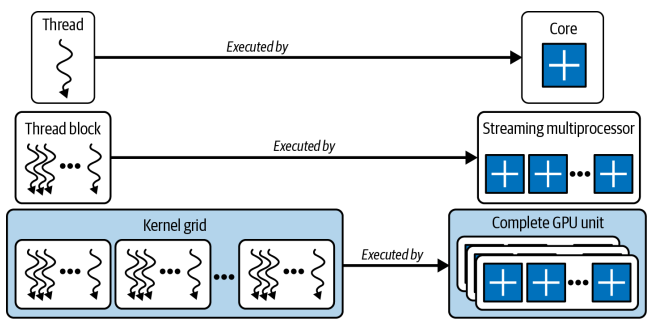
</Frame>

<Frame caption="CUDA block 与 grid 的二维/三维组织方式">
  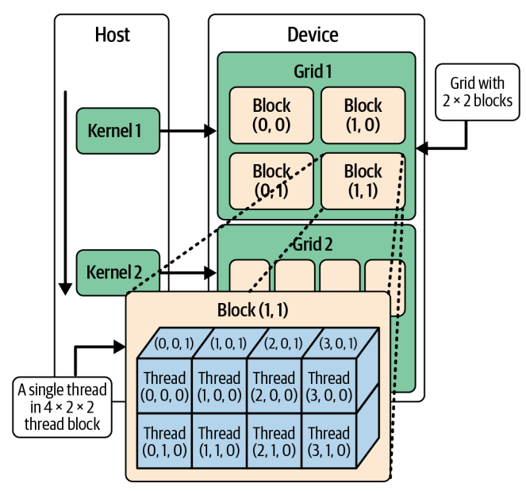
</Frame>
- thread：最小执行单位，每个 thread 执行一份 kernel 代码。
- thread block，也叫 CTA：由多个 thread 组成，同一个 block 内线程可以协作。
- grid：一次 kernel launch 中所有 block 的集合。

同时，硬件执行时还会把 thread 组织成 warp。warp 不一定是 CUDA 源码中的显式结构，但它是理解性能的关键。

可以这样理解：

> 编写 CUDA kernel 时，描述的是每个线程要做什么；启动 kernel 时，决定开多少个 block、每个 block 有多少 thread；硬件执行时，又会把 thread 按 32 个一组组成 warp 去调度。

同一个 block 内线程可以使用 shared memory 共享数据，也可以用 `__syncthreads()` 同步。例如在矩阵乘法中，一个 block 可以先把一个 tile 的数据加载到 shared memory，block 内线程共同使用这份数据，减少对 global memory 的重复访问。

但同步也是需要耗时，`__syncthreads()` 会让 block 内线程在某一点等待彼此，如果同步点太多，就会增加开销。因此应尽量减少不必要的同步屏障（barrier）。

现代 GPU 支持 thread block cluster（此特性在 Hopper 架构引入）。之前的 CUDA 中，不同 block 之间通常不能直接协作，因为 block 的执行顺序不保证，也不一定在同一个 SM 上。但现在 GPU 支持把多个 block 组成 cluster，让它们跨 SM 通信。

DSMEM 也就是 distributed shared memory。它把参与 cluster 的多个 SM 的 shared memory 通过片上互连连接起来，使不同 block 可以访问彼此的 shared memory，并使用 cluster 级别的 barrier。

<Frame caption="Thread block cluster 和 DSMEM 跨 SM 共享内存结构">
  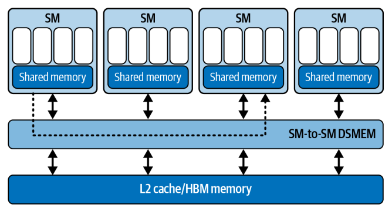
</Frame>

总结来说，CUDA 的层级结构让大问题可以被拆成很多 block，再由 block 拆成很多 thread。普通协作发生在 block 内，更高级的跨 block 协作则依赖 thread block cluster 和 DSMEM。

### 2 CUDA 编程基础与启动配置

CUDA kernel 编写、启动参数以及多维输入映射的核心问题是：如何把数据任务映射到 CUDA 线程层级上，并让 kernel 启动配置符合硬件执行方式。

#### 2.1 选择 threadsPerBlock 和 blocksPerGrid

启动参数是编写 CUDA kernel 最先遇到的问题。`threadsPerBlock` 通常要选择 32 的倍数。原因很直接：warp 大小固定为 32。如果 block size 不是 32 的倍数，就会产生不完整 warp，浪费了可以进行并行的资源。

例如：

- `threadsPerBlock = 256`，等于 8 个完整 warp。
- `threadsPerBlock = 33`，需要 2 个 warp，但第二个 warp 只有 1 个线程有用，其余 31 个 lane 被浪费。

因此，常见起点是 `threadsPerBlock = 256`。这个配置有 8 个 warp，通常能在 occupancy 和资源使用之间取得较好平衡。根据 kernel 的寄存器使用、shared memory 使用和 profiling 结果，也可以尝试 128、512 等配置。

Blackwell B200 有一些硬件限制：

- warp size 是 32。
- 每个 thread block 最多 1024 个线程，也就是最多 32 个 warp。
- 每个 SM 最多 64 个 resident warp。
- 每个 SM 最多 2048 个 resident thread。
- 每个 SM 最多 32 个 active block。

这些限制决定了一个 SM 上到底能同时放下多少 block 和 warp。例如，如果一个 block 有 1024 个线程，那么一个 block 就占 32 个 warp，一个 SM 最多只能同时驻留两个这样的 block，因为 2 个 block 已经达到 64 个 warp。相反，如果一个 block 是 256 个线程，那么一个 block 是 8 个 warp，理论上一个 SM 可以驻留更多 block，直到碰到 warp、thread、block、register 或 shared memory 限制。

`blocksPerGrid` 的计算通常使用向上取整：

```cpp
int threadsPerBlock = 256;
int blocksPerGrid = (N + threadsPerBlock - 1) / threadsPerBlock;
```

这个公式用于保证所有 `N` 个元素都被覆盖。比如 `N = 1000`，`threadsPerBlock = 256`，那么需要 4 个 block，因为 3 个 block 只能覆盖 768 个元素。

但这样最后一个 block 可能会有多余线程，所以 kernel 内必须加边界检查：

```cpp
int idx = blockIdx.x * blockDim.x + threadIdx.x;
if (idx < N) {
    input[idx] *= 2.0f;
}
```

`if (idx < N)` 非常关键。如果没有这个检查，多出来的线程可能访问数组边界外的地址，引发非法内存访问。

CUDA grid 本身也有维度限制，例如 X 维最多可到 2,147,483,647 个 block，Y/Z 维最多 65,535 个 block，并且一个设备最多可以有 128 个 concurrent grids。不过实际开发中，通常更先碰到的是 thread、block、register、shared memory 这些资源限制。

如果某一维度需要超过 65,535 个块，可以启动 2D 或 3D 网格，将工作拆分到多次内核启动（多次启动）。实际上，在达到其他资源限制之前就触及网格大小限制的情况很少见。

#### 2.2 CUDA kernel 基本写法

一个 kernel 用 `__global__` 修饰，表示它在 GPU device 上执行，由 CPU host 端启动。例如：

```cpp
__global__ void myKernel(float* input, int N) {
    int idx = blockIdx.x * blockDim.x + threadIdx.x;
    if (idx < N) {
        input[idx] *= 2.0f;
    }
}
```

重点理解三个内置变量：

- `threadIdx.x`：当前线程在 block 内的编号。
- `blockIdx.x`：当前 block 在 grid 中的编号。
- `blockDim.x`：每个 block 有多少线程。

通过这三个值，线程可以算出自己的全局索引 `idx`。这就是 CUDA kernel 的基本套路：每个线程先找到自己负责的数据位置，然后只处理这一小块数据。

CUDA kernel 是异步执行的。CPU 启动 kernel 后不会自动等待 GPU 执行完。如果 kernel 中发生越界访问，错误也可能不会立刻显示，而是在后续同步或 CUDA API 调用时才出现。因此开发时通常需要检查：

```cpp
cudaGetLastError();
cudaDeviceSynchronize();
```

CUDA 调试和 CPU 程序不同，错误可能是“延迟暴露”的，因此边界检查和同步检查非常重要。

#### 2.3 2D/3D 输入映射

输入也可以是 2D 或 3D 结构。

如果输入是图像，本身就是二维结构，就可以使用二维 block 和二维 grid。比如一个 1024 x 1024 的矩阵，可以用：

```cpp
dim3 threads(16, 16);
dim3 blocks((width + 15) / 16, (height + 15) / 16);
```

这个配置中，每个 block 有 `16 x 16 = 256` 个线程，仍然符合常见起点。kernel 内部可以计算二维坐标：

```cpp
int x = blockIdx.x * blockDim.x + threadIdx.x;
int y = blockIdx.y * blockDim.y + threadIdx.y;

if (x < width && y < height) {
    int idx = y * width + x;
    input[idx] *= 2.0f;
}
```

这个例子把 CUDA 的 block/grid 和图像像素对应起来：每个线程负责一个像素，`x` 和 `y` 表示当前线程处理哪一列、哪一行。

如果是 3D 体数据，也可以使用 `dim3(x, y, z)` 把线程映射到三维空间。大多数 CUDA 性能示例会使用 1D 或 2D tiled 配置，但理解 3D 映射有助于处理体数据、三维网格等任务。

### 3 GPU 内存体系与数据移动

内存管理、内存层级、TMEM/TMA 和 Unified Memory 都围绕一个核心问题：GPU 性能优化的关键往往不是“多算几次”，而是“少等数据”。

#### 3.1 异步内存分配、memory pool 和 stream

标准的 `cudaMalloc` 和 `cudaFree` 是同步且相对昂贵的。其中，“同步”指：为了保证内存分配或释放是安全的，CUDA runtime / driver 可能需要等待设备上相关工作完成，甚至引入全设备级别的同步。这样一来，本来可以继续排队执行的 GPU 工作会被打断，CPU 端也可能被迫等待。

除了同步开销，传统分配释放还涉及驱动和操作系统级调用。这种交互会引发用户态到内核态的上下文切换，以及 NVIDIA 驱动内部的显存资源管理开销。`mmap` / `ioctl` 就属于这类底层系统调用：`mmap` 常用于建立内存映射，`ioctl` 常用于向设备驱动发送控制命令。它们不是普通函数调用，而是会进入操作系统内核和驱动层，因此比纯设备端操作更慢。

如果只是程序启动时分配几块长期使用的大 buffer，这种开销通常可以接受。但如果在训练循环、推理服务或某个高频算子路径中反复申请和释放小 buffer，开销就会不断累积，表现为延迟尖峰、GPU 时间线空洞，甚至影响端到端吞吐。

因此，推荐使用：
- `cudaMallocAsync`
- `cudaFreeAsync`
- CUDA memory pool
- non-blocking stream

`cudaMallocAsync` 和 `cudaFreeAsync` 的核心思想是 stream-ordered allocation，也就是“按 stream 顺序管理内存生命周期”。分配、kernel 执行和释放都放入同一个 stream 后，CUDA 只需要保证这个 stream 内部的顺序正确，而不需要轻易做全设备同步。

示例写法：
```cpp
cudaStream_t s;
cudaStreamCreateWithFlags(&s, cudaStreamNonBlocking);

float* d_buf = nullptr;
cudaMallocAsync(&d_buf, N * sizeof(float), s);
myKernel<<<blocks, threads, 0, s>>>(d_buf, N);

cudaFreeAsync(d_buf, s);
cudaStreamSynchronize(s);
```

这个例子可以按顺序理解：
1. 创建一个 non-blocking stream，避免 legacy default stream 带来的隐式同步。
2. 在这个 stream 上用 `cudaMallocAsync` 分配 `d_buf`。
3. 在同一个 stream 上启动使用 `d_buf` 的 kernel。
4. 在同一个 stream 上调用 `cudaFreeAsync` 释放 `d_buf`。
5. 最后通过 `cudaStreamSynchronize(s)` 等待这个 stream 中的工作完成。

stream 是一个有序队列。同一个 stream 内的操作按顺序执行，比如先分配、再拷贝、再启动 kernel、再释放。不同 stream 之间则有机会并发或重叠。因此，`cudaFreeAsync(d_buf, s)` 并不是立即粗暴地释放内存，而是表示：等到这个 stream 中前面依赖 `d_buf` 的工作完成后，再把这块内存释放回池子。

这和传统 `cudaFree` 的差异很关键。传统 `cudaFree` 为了确认没有 GPU 工作还在使用这块内存，往往需要更强的同步；而 `cudaFreeAsync` 借助 stream 顺序，知道同一 stream 中前面的 kernel 已经排在释放之前，因此可以避免不必要的全局同步。

`cudaMallocAsync` 和 `cudaFreeAsync` 底层使用 CUDA memory pool。memory pool 是显存缓存池：第一次需要某个大小的 buffer 时，CUDA 可能仍然需要向底层驱动申请显存；但释放时，这块显存不一定立刻还给系统，而是回到 pool 中。后面再次申请相近大小的 buffer 时，可以直接从 pool 中复用。

这种机制有三个好处：
- 减少反复调用底层驱动和操作系统接口的次数。
- 减少全设备同步带来的停顿。
- 通过复用已经申请过的显存块，降低长期运行程序中的碎片和延迟抖动。

PyTorch 也采用类似思路，不会在每次 tensor 生命周期结束时立刻把显存还给系统，而是缓存起来复用。这样训练循环中反复创建 tensor 时，就不会每次都触发昂贵的底层 `cudaMalloc`。

可以用一个训练循环的例子来理解：每一轮 iteration 里都会产生很多临时 tensor，比如中间激活、临时 workspace、后处理 buffer。如果每个临时 tensor 都真正触发一次底层显存申请和释放，整个训练过程会频繁打断 GPU 工作；如果使用缓存分配器或 memory pool，这些临时显存可以在多轮 iteration 中反复复用，性能会更稳定。

不过也需要注意，memory pool 并不是让显存消耗凭空减少。它更像是“缓存已申请的显存以便复用”。因此在监控工具中可能看到程序占用的显存没有马上下降，这是正常现象。它换来的是更低的分配开销和更稳定的延迟。如果确实需要把显存还给系统，可以通过 CUDA memory pool 的相关属性或 trim 操作进行控制，例如调节 release threshold 等策略。


对长时间运行、频繁申请临时显存的程序来说，异步分配和 memory pool 的价值不只是“更快”，更重要的是把内存生命周期纳入 stream 顺序管理，减少全局同步、底层驱动调用和延迟抖动。

#### 3.2 GPU 内存层级：从 register 到 HBM

GPU memory hierarchy 是 CUDA 性能优化中最容易混淆的部分之一。有些名称来自 CUDA 编程模型，有些名称来自硬件结构图。理解内存层级时，可以先把“逻辑视角”和“物理视角”分开。

从 CUDA 编程模型看，常见内存名称包括：

- register：每个线程私有，保存局部变量和临时值。
- local memory：逻辑上属于单个线程私有，但很多情况下物理上落到 global memory / HBM。
- shared memory：一个 block 内线程共享，由程序员显式使用。
- global memory：CUDA 代码中通过 `cudaMalloc` 等方式分配的 device memory。
- constant memory：用于小型只读常量数据。


Blackwell 架构下的主要硬件层级包括：

<Frame caption="Blackwell GPU 内存层级结构：从 register 到 HBM 的完整数据通路">
  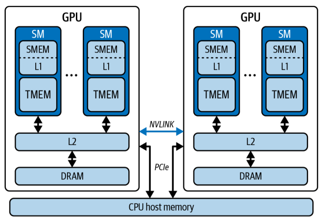
</Frame>

从硬件数据通路看，图里更常见的是：

```text
SM 内部：register file / L1 cache / shared memory / TMEM
GPU 全局：L2 cache
显存：HBM / DRAM
```

图中画出 SMEM、L1、TMEM、L2、DRAM，并不代表 register、local memory、constant memory 不存在，而是图选择突出主要的数据搬运路径，尤其是面向 Tensor Core 的数据路径。

可以把两种视角对应起来：

| CUDA 或术语视角            | 硬件/物理理解                 | 说明                        |
| --------------------- | ----------------------- | ------------------------- |
| register              | SM 内 register file      | 线程私有、最快、容量小               |
| shared memory / SMEM  | SM 内片上 SRAM             | block 内线程共享，程序员显式管理       |
| L1 cache              | SM 内缓存                  | 硬件自动缓存当前 SM 的访存           |
| TMEM                  | SM 内 Tensor Core 相关片上存储 | 服务矩阵乘加和累加路径               |
| L2 cache              | GPU 全局共享缓存              | 位于所有 SM 和 HBM 之间          |
| global memory         | 通常物理上是 HBM/DRAM         | 存放大 tensor、权重、输入输出        |
| local memory          | 逻辑线程私有，常物理落在 HBM        | 常见于 register spill 或大局部数组 |
| constant memory cache | SM 内小型只读缓存              | 适合 warp 内广播读取常量           |

整体原则是：

> 越靠近计算单元，速度越快、容量越小、成本越高；越远离计算单元，容量越大、延迟越高。优化 CUDA kernel，本质上就是尽量让数据在靠近 SM 和 Tensor Core 的地方复用，减少反复访问 HBM。

register 是最快的存储，每个线程私有，用来保存局部变量和临时变量。Blackwell 每个 SM 有 64K 个 32-bit registers，每个线程最多可使用 255 个寄存器。但寄存器不是越多越好。如果每个线程用太多寄存器，一个 SM 能同时容纳的线程数量就会下降，occupancy 可能降低。更糟的是，如果寄存器不够，编译器会把数据 spill 到 local memory。

local memory 这个名字容易误导。它虽然叫 local，但并不是一块独立的高速片上内存。很多情况下，local memory 是寄存器溢出后落到 global memory / HBM 支撑的空间，延迟很高。因此，local memory 使用过多往往说明 register pressure 有问题。

补充一点：local memory 通常不是程序员主动使用的。多数 CUDA 代码里不会显式写“使用 local memory”，它更多是 CUDA 编译器在寄存器放不下线程私有数据时自动生成的“备用空间”。例如，一个线程里有太多局部变量、线程私有数组太大、数组索引无法在编译期确定，或者复杂函数调用产生很多临时值时，编译器可能无法把所有数据都放进 register，于是把一部分数据 spill 到 local memory。因此，平时写 CUDA 程序时很少“主动使用 local memory”是正常的。但在性能优化时必须关注它，因为它可能悄悄出现并拖慢 kernel。可以通过编译参数 `-Xptxas -v` 查看是否出现 `spill loads` / `spill stores`，也可以在 Nsight Compute 中观察 local memory load/store、registers per thread 和 spilling 相关指标。

shared memory / L1 cache 位于 SM 内，延迟远低于 HBM。二者都和 SM 内部片上 SRAM 资源相关，但角色不同：

- shared memory，也叫 SMEM，由程序员显式管理，适合 block 内线程共享数据。
- L1 cache 由硬件自动管理，用于缓存当前 SM 的访存结果。

比如矩阵乘法中，可以把一个 tile 先加载进 shared memory，然后 block 内多个线程重复使用这批数据，减少 global memory 访问。这样做的本质是：用更小、更快的片上存储，换取对 HBM 的访问次数减少。

但 shared memory 也有代价：

- 容量有限。
- 需要同步。
- 可能出现 bank conflict。
- 使用太多 shared memory 会减少每个 SM 可驻留的 block 数，影响 occupancy。

TMEM 是 Blackwell 中与 Tensor Core 路径相关的片上存储。它不是普通 CUDA C++ 指针可以直接读写的空间，而是服务 Tensor Core 指令和矩阵乘加累加路径。现代 AI 计算中，Tensor Core 数据路径非常关键。

L2 cache 是全 GPU 共享缓存，位于所有 SM 和 HBM 之间。可以把它理解成一个全局缓冲层：当某个 SM 从 global memory 读取数据时，数据可能先经过 L2；如果后续其他 SM 或同一个 SM 再访问相同或相邻的数据，就可能从 L2 中命中，而不必重新访问 HBM。Blackwell Tuning Guide 提到 GB200 GPU 的 L2 cache 可到 126 MB，这个容量比每个 SM 内部的 shared memory / L1 大很多，因此更适合做跨 SM 的数据复用缓冲。

global memory 是 CUDA 编程视角的设备全局内存；在 A100、H100、B200 这类数据中心 GPU 上，它在硬件上通常对应 HBM。也就是说：

```text
CUDA 视角：global memory
硬件视角：HBM / HBM2e / HBM3 / HBM3e
```

HBM 全称是 High Bandwidth Memory，即高带宽内存。它容量大、带宽高，但相对于 register、shared memory、L1/L2 cache 来说，延迟仍然高。以 Blackwell B200 为例，HBM3e 容量可到约 180 GB，带宽约 8 TB/s。这个带宽听起来非常高，但 GPU 的 Tensor Core 计算吞吐也非常高，因此很多时候问题不是“算不动”，而是“数据来不及送到计算单元”。

经过 L2 的全局内存访问有机会被后续访问复用，从而减少再次访问 HBM / DRAM。为了最大化 L2 和内存事务效率，应尽量让 warp 内的全局加载形成 128 字节对齐、连续合并的 coalesced 访问。

比如一个 warp 有 32 个线程，如果第 0 个线程读取 `A[0]`，第 1 个线程读取 `A[1]`，一直到第 31 个线程读取 `A[31]`，那么这些访问在地址上是连续的，硬件可以把它们合并成少数几次高效的内存事务。相反，如果 32 个线程访问的地址很分散，例如分别访问 `A[0]`、`A[1024]`、`A[2048]` 这样的跨步地址，硬件就很难把它们合并成连续事务，可能需要发起更多内存请求。这样即使 HBM 的理论带宽很高，实际有效带宽也会下降。

在大模型 decode 阶段，HBM 带宽瓶颈尤其明显。decode 通常是逐 token 生成，每一步都需要读取大量模型权重，但 batch 或当前 token 的计算量相对有限。也就是说，GPU 需要不断从 HBM 中搬运大规模权重数据，但每搬一次数据能做的计算不一定足够多，导致算术强度偏低。这类场景就容易 memory-bound：Tensor Core 或 CUDA Core 可能没有被完全喂饱，性能主要受 HBM 带宽和数据移动效率限制。（vLLM 通过 PagedAttention、continuous batching 改善推理吞吐和 KV cache 管理）

小结：
>图中画出的 SMEM、L1、TMEM、L2、DRAM 是主要硬件数据通路；而 register、local memory、constant memory 等名称更多来自完整 CUDA 内存模型或特定用途。理解这两种视角后，再看内存优化，就能更清楚地区分“代码里看到的内存名称”和“数据在硬件上实际经过的路径”。

#### 3.3 TMEM、TMA 和 Tensor Core 数据路径

Blackwell 中的 TMEM 和 TMA 属于较新的架构能力，值得单独说明。

TMEM 是 Tensor Memory，是 Blackwell 每个 SM 上专门服务 Tensor Core 的片上内存。TMEM 每个 SM 大约 256 KB，用于第五代 Tensor Core 指令，比如 `tcgen05.*` 和 UMMA。

需要注意的是，TMEM 不是普通 CUDA C++ 指针可以直接读写的空间。它不像 global memory 或 shared memory 那样用普通指针访问，而是通过 Tensor Core 相关指令和描述符参与数据移动。


TMA 是 Tensor Memory Accelerator，用于大块数据传输。

TMA 是专用硬件单元，负责将数据从 Global Memory 高效传输到 Shared Memory：

```text
TMA 示意图：

Global Memory ◄──► L2 Cache ◄──► L1/Shared Memory
                      
                     
               ┌─────────────┐
               │  TMA Unit  │  ← 专用硬件，不占用执行单元
               └─────────────┘
```

一个矩阵乘法路径大致是：

1. tile 数据从 global memory 经过 L2 cache 进入 shared memory。
2. TMA 负责协调这些大块数据搬运。
3. Tensor Core 相关指令会配合 shared memory / TMEM 完成矩阵乘加路径。

<Frame caption="TMA 数据搬运路径：从 Global Memory 经 L2 高效传输到 Shared Memory">
  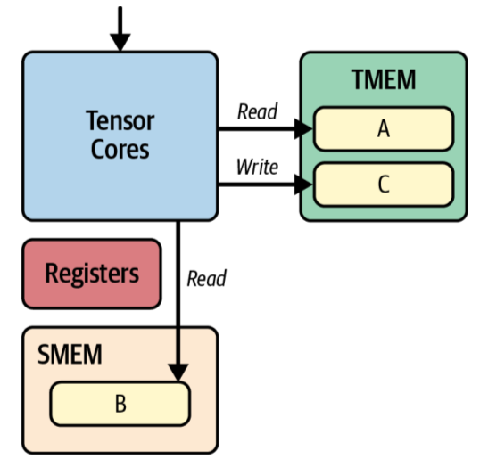
</Frame>

可以用矩阵乘 `C = A x B` 来解释：矩阵乘不是每次都直接从 HBM 读取所有元素给 Tensor Core，而是把数据分块搬到更靠近计算单元的位置，例如 shared memory 和 TMEM。这样 Tensor Core 才不会频繁等待 HBM 数据。

TMEM 和 TMA 是近年来 GPU 架构中引入的重要能力，主要面向高吞吐量的矩阵计算场景。虽然在普通 CUDA 编程中通常不会直接使用这些底层机制，但理解其设计思想有助于认识现代 AI 加速器的优化方向。对于矩阵乘法、注意力机制以及大模型推理等计算密集型任务而言，性能瓶颈往往不仅来自计算能力本身，更来自数据能否高效地从 HBM、L2 Cache 和 Shared Memory 持续输送至 Tensor Core。因此，现代 GPU 架构越来越重视数据移动效率，以充分发挥 Tensor Core 的计算性能。

小结：
> TMEM 和 TMA 的核心作用在于优化大规模矩阵计算中的数据搬运路径，使 Tensor Core 能够持续获得所需数据，从而将更多时间用于计算而非等待数据传输。

#### 3.4 统一内存（Unified Memory）

统一内存（Unified Memory，也称 Managed Memory）是 CUDA 提供的一种简化内存管理的机制，通过 `cudaMallocManaged()` 分配的内存可被 CPU 和 GPU 共享同一虚拟地址空间访问。

传统 CUDA 编程中，Host Memory 与 Device Memory 相互独立，开发者需要显式管理数据传输：

```cpp
cudaMalloc(&d_ptr, size);
cudaMemcpy(d_ptr, h_ptr, size, cudaMemcpyHostToDevice);
```

而 Unified Memory 中：

```cpp
cudaMallocManaged(&ptr, size);
```

CPU 与 GPU 可以直接访问同一个指针，无需显式维护 Host Buffer 和 Device Buffer。

需要注意的是，Unified Memory 统一的是地址空间，而非物理存储位置。数据页可能驻留在 CPU 内存，也可能驻留在 GPU 显存。当 GPU 访问尚未迁移到显存的数据页时，会触发 Page Fault，Runtime 将对应页面迁移到 GPU 后再继续执行。

```text
GPU Access
    │
    ▼
Page Fault
    │
    ▼
Page Migration
    │
    ▼
Resume Kernel
```

因此，Unified Memory 的主要问题是隐藏的页面迁移开销（Page Migration Overhead）。代码虽然更简单，但运行时可能因为 Page Fault 导致额外延迟。

CUDA 提供了一些优化接口：

- `cudaMemPrefetchAsync()`：提前迁移数据。
- `cudaMemAdvise()`：向 Driver 提供数据放置建议。
- `cudaStreamAttachMemAsync()`：将内存关联到指定流（stream）。

统一内存更强调编程的便利性，而传统显式内存管理方式更强调对数据传输过程和存储位置的精确控制。因此，在高性能 CUDA 应用中，通常仍采用显式内存管理方式以获得更好的性能优化空间；而统一内存则广泛应用于原型开发、算法验证以及 CPU-GPU 协同计算等场景。随着 GPU 架构和统一内存技术的不断发展，两者之间的性能差距正在逐渐缩小。


### 4 Occupancy 调优与正确性检查

Occupancy、GPU 利用率、launch bounds、Occupancy API 以及 Compute Sanitizer 关注两个问题：如何让 GPU 有足够多的有效工作，以及如何保证 CUDA 程序本身是正确的。

#### 4.1 占有率（Occupancy） 和 GPU 利用率：向量加法例子

occupancy 指的是 SM 中活跃 warp 数占理论最大 warp 数的比例。高 occupancy 的价值是隐藏延迟：当一个 warp 在等待内存时，SM 可以切换到其他 warp 执行。

Occupancy 很重要，但并不是越高越好。真正目标是提高吞吐量，而不是单纯把 occupancy 数字堆到 100%。

以长度为 `N` 的两个向量求和 `C = A + B` 做例子。基本写法 `add_sequential` 只用一个线程或一个 warp 处理所有元素：

```cpp
for (int i = 0; i < N; ++i) {
    C[i] = A[i] + B[i];
}
```

这种写法等于把 GPU 当成单线程 CPU 使用。GPU 的大量 SM、warp scheduler 和计算流水线都处于闲置状态。

性能更高的版本 `add_parallel` 是每个线程处理一个元素：

```cpp
int idx = blockIdx.x * blockDim.x + threadIdx.x;
if (idx < N) {
    C[idx] = A[idx] + B[idx];
}
```

<Frame caption="向量加法串行 vs 并行执行：GPU 利用率与 occupancy 对比">
  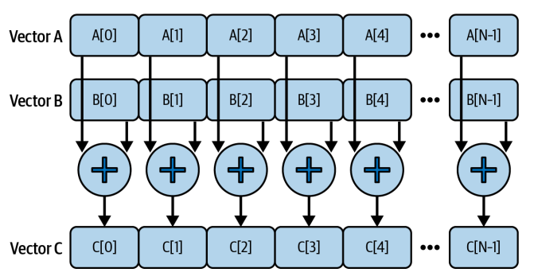
</Frame>

Profiling 对比非常直观：

<Frame caption="Nsight Compute 向量加法串行与并行版本的 profiling 对比">
  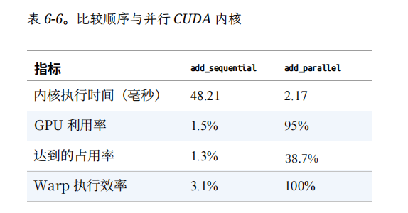
</Frame>

这些指标可以这样理解：

- kernel 时间下降，说明并行化直接提高了端到端执行速度。
- GPU 利用率 从 1.5% 到 95%，说明 GPU 从“大部分时间闲着”变成“大部分时间有工作可做”。串行版本中只有单个 SM 上的少数线程在工作，而并行版本中许多 SM 都在运行多个活跃 warp。
- achieved occupancy 从 1.3% 到 38.7%，说明 SM 中可调度的活跃 warp 明显变多，硬件有更多机会隐藏延迟。
- warp 执行效率从 3.1% 到 100%，说明并行版本中 warp 内 32 个线程基本都在做有效工作，而不是只有少量 lane 在执行。串行版本里，一个 warp 虽然硬件上仍以 32 个 lane 为单位执行，但只有一个线程有用，其余 lane 大多处于无效状态，因此效率很低。

一个容易混淆的点是：GPU 是面向吞吐量优化的处理器，不是为了让少数线程跑得尽可能快，而是为了让大量线程同时推进。CPU 负责发起 kernel，GPU 内部的 SM、warp scheduler、计算单元和内存子系统共同执行 kernel。这个过程中会不断发生访存、cache 访问、指令依赖等等待。如果只有很少线程，这些等待会直接变成硬件空闲；如果有足够多 warp，SM 就可以在 warp 之间切换，用其他 warp 的计算或访存来覆盖等待时间。

因此，这个例子说明了 GPU 优化的第一步：先给 GPU 足够多的并行工作。无论单个线程写得多快，如果线程数量太少，就无法利用 GPU 的吞吐量潜力。

并行版本的 achieved occupancy 只有约 38.7%，并不是 100%，但性能已经大幅提升。这说明 occupancy 不是越高越好。只要活跃 warp 足够隐藏主要延迟，性能瓶颈就可能转移到别处。后续优化才会进入更细的层面，例如提高每个 warp 内部的指令级并行性、减少指令依赖、改善内存访问模式，或者提高 Tensor Core / CUDA Core 的实际利用率。

当 occupancy 达到 100%，性能仍可能不好，因为程序可能是 memory-bound。memory-bound 指的是性能主要受内存访问限制，而不是受计算能力限制。一个典型例子是大语言模型的 decode 阶段。


这个例子说明，GPU 优化第一步往往不是复杂技巧，而是先确保启动足够多的并行工作。如果 kernel 只启动很少线程，那么后面再讨论 shared memory、Tensor Core、coalesced access 等优化都意义有限，因为 GPU 硬件根本没有被充分调动起来。


#### 4.2 launch bounds 和 Occupancy API：在资源和并行度之间找平衡

occupancy 并不是只靠增加线程数就能提高。一个 SM 能同时驻留多少 block 和 warp，还取决于每个线程使用多少寄存器、每个 block 使用多少 shared memory，以及硬件本身的 resident thread / resident block 上限。如果每个线程或每个 block 占用资源太多，SM 上能同时运行的 warp 就会减少，隐藏延迟的能力也会下降。


CUDA 提供了 `__launch_bounds__` kernel 注解，用来在编译阶段给编译器提供 occupancy 相关提示：

```cpp
__global__ __launch_bounds__(256, 4)
void myKernel(...) {
    // ...
}
```


`__launch_bounds__(256, 4)` 表示两层含义：
- `256` 表示承诺这个 kernel 启动时，每个 block 的线程数不会超过 256。
- `4` 表示希望每个 SM 至少可以常驻 4 个 block。
`launch_bounds` 的第一个参数是实际 `threadsPerBlock` 的上限，第二个参数不是 `blocksPerGrid`。

这个注解会影响编译器的寄存器分配、函数内联和循环展开策略。它的目的不是突破硬件上限，而是让编译器在“单个线程使用更多资源”和“让更多 warp 常驻 SM”之间做取舍。现代 NVIDIA GPU 每个 SM 的常驻 thread 数量有上限，例如 2048。`4 x 256 = 1024` 没有超过这个线程上限，但真实常驻数量仍可能继续受 register、shared memory 和 active block 上限限制。

实践中，`__launch_bounds__` 可能会限制每个线程使用的寄存器数量，从而让更多 warp 同时驻留在 SM 上，提高延迟隐藏能力（更稳定的吞吐量）。但限制也不能过度。如果寄存器太少（一个 SM 驻留更多的线程/Block），编译器可能把放不下的变量 spill 到 local memory。local memory 虽然逻辑上是线程私有的，但物理访问通常走 global memory / HBM 路径，比 register 慢得多。因此，launch bounds 的核心是平衡。

```cpp
int threadsPerBlock = 256;
int blocksPerGrid = (N + threadsPerBlock - 1) / threadsPerBlock;
kernel<<<blocksPerGrid, threadsPerBlock>>>(...);
```

除了手动给出 launch bounds，CUDA 还提供了 Occupancy API，`cudaOccupancyMaxPotentialBlockSize()` 做的事情是：它会看这个 kernel 大概要用多少寄存器、多少 shared memory，再结合当前 GPU 的 SM 资源限制，帮你算一个理论上 occupancy 比较高的 block size。

```cpp
int minGridSize = 0;
int bestBlockSize = 0;

size_t dynSmemBytes = 0;

cudaOccupancyMaxPotentialBlockSize(
    &minGridSize,
    &bestBlockSize,
    myKernel,
    dynSmemBytes,
    0
);

int gridSize = std::max(
    minGridSize,
    (N + bestBlockSize - 1) / bestBlockSize
);

myKernel<<<gridSize, bestBlockSize, dynSmemBytes>>>(...);
```

两个返回值需要区分：

- `bestBlockSize` 是 API 建议的每 block 线程数。
- `minGridSize` 是为了让该 kernel 在当前设备上达到 occupancy 饱和，至少需要启动的 block 数。

`minGridSize` 不是为了覆盖输入长度 `N` 的 grid size。因此真正启动 kernel 时，还需要结合输入规模计算：

```cpp
gridSize = std::max(minGridSize, (N + bestBlockSize - 1) / bestBlockSize);
```

如果 kernel 使用 `extern __shared__` 这样的动态 shared memory，调用 Occupancy API 时也要传入真实的动态 shared memory 大小，因为 shared memory 使用量会影响一个 SM 能同时容纳多少 block。

最后：
1. 很多简单 kernel 直接用 `128`、`256`、`512` 线程每 block 就够了。
2. 这个 API 只给“理论 occupancy 较高”的建议，不保证最快。
3. 真正性能还受访存是否连续、L2 命中率、寄存器溢出、shared memory 使用、同步开销等影响。
4. PyTorch、TensorRT、cuBLAS 这类库内部已经帮你做了 kernel 配置和调优，平时不需要手动用。

所以它更像是一个辅助调参工具，不是 CUDA 编程必须每次都用的东西。普通代码先用 `threadsPerBlock = 256`，再用 Nsight 看性能，是常见的做法。


小结：

> `__launch_bounds__` 和 Occupancy API 都是在帮助程序员理解并调节 occupancy，但它们不是追求最高 occupancy 的万能工具。真正目标是让 SM 有足够多的 warp 隐藏延迟，同时避免寄存器不足、shared memory 占用过高或 spilling 带来的性能损失。


#### 4.3 Compute Sanitizer 调试功能正确性

NVIDIA Compute Sanitizer 是随 CUDA Toolkit 提供的功能正确性套件，它通过在运行时对代码进行插桩来在开发早期发现错误。

CUDA kernel 往往会启动成千上万个线程，错误不一定像普通 CPU 程序那样容易复现。比如某个线程越界访问、多个线程同时写 shared memory、读取未初始化的 device memory，或者 barrier 使用不一致，都可能造成隐蔽 bug。程序如果本身不正确，后面的性能分析也就失去了可靠基础。

Compute Sanitizer 是 CUDA Toolkit 提供的功能正确性检查工具。它通过运行时插桩来发现 CUDA 程序中的内存错误、竞争条件、初始化问题和同步问题。常见调用形式是：

```bash
compute-sanitizer [--tool toolname] [options] <application> [app_args]
```

同时也可以配合 `--kernel-name`、`--kernel-name-exclude` 只检查特定 kernel，也可以用 `--nvtx yes` 结合 NVTX 区间缩小分析范围。实际工程中，还可以用 `--error-exitcode` 把 Compute Sanitizer 集成到 CI 中，让正确性问题直接导致流水线失败。

Compute Sanitizer 主要包含四类工具，它们有助于检测越界内存访问、数据竞争、未初始化内存读取以及 CUDA 代码中的同步问题：
- `memcheck`：检查 global、local、shared memory 中的越界访问、未对齐访问、GPU 硬件异常和 device 侧内存泄漏，也可以配合 `--check-device-heap` 检查设备端堆分配。
- `racecheck`：检查 shared memory 中的数据竞争，例如 Write-After-Write、Write-After-Read、Read-After-Write。这类问题可能导致结果不稳定，同样输入多次运行也可能得到不同结果。
- `initcheck`：检查未初始化的 device global memory 读取。常见原因是 host-to-device 拷贝遗漏，或者某些线程分支没有完成写入。
- `synccheck`：检查同步原语使用错误，例如 barrier 不匹配。同步错误可能造成线程之间状态不一致，严重时会导致死锁。

小结：
> CUDA 优化不能只看速度，必须先保证 kernel 的功能正确。只有解决了：程序是否算对、是否安全访问内存、线程同步是否合理等问题，后面的 profiling 结果才有意义。


### 5 性能分析

Roofline、Nsight 工具和 NVTX 可以组成性能分析闭环。

#### 5.1 Roofline 模型：判断 memory-bound 还是 compute-bound

Roofline 模型是一种有用的可视化方法，用于判断 kernel 的主要瓶颈来自计算吞吐，还是来自数据搬运。

<Frame caption="Roofline 模型：计算峰值与内存带宽限制决定 kernel 的优化方向">
  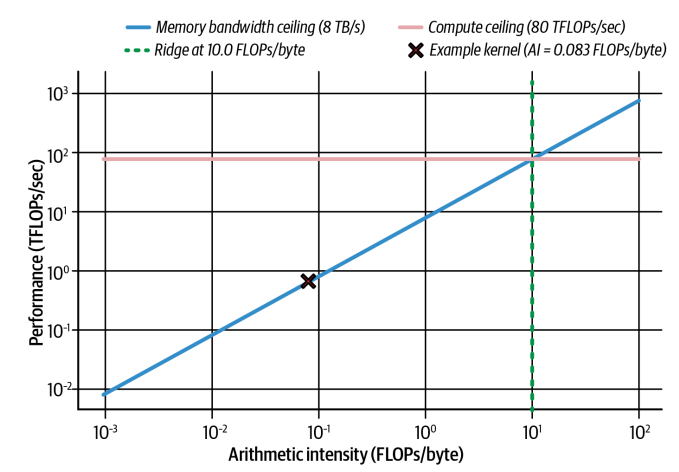
</Frame>


Roofline 模型有两条上限：

- 一条水平线：表示硬件峰值计算能力。
- 一条斜线：表示内存带宽限制。

关键指标是算术强度（arithmetic intensity），也就是每传输 1 字节数据能做多少 FLOP。

$$
算术强度=\frac{\text{计算量(FLOPs)}}{\text{内存访问量(Bytes)}}
$$

用 FP32 向量加法举例：
- 读取 `A[i]`：4 bytes。
- 读取 `B[i]`：4 bytes。
- 写回 `C[i]`：4 bytes。
- 总共 12 bytes 数据流量。
- 只做 1 次加法，也就是 1 FLOP。

所以算术强度是：

```text
1 FLOP / 12 bytes = 0.083 FLOPs/byte
```

以 Blackwell 级 GPU 为例，假设 FP32 峰值约 80 TFLOPs/s，HBM3e 带宽约 8 TB/s，那么 ridge point 约为：

```text
80 TFLOPs/s / 8 TB/s = 10 FLOPs/byte
```

向量加法只有 `0.083 FLOPs/byte`，远低于 10，因此它明显是 memory-bound。也就是说，它不是算力不够，而是每搬很多数据只做了一点点计算，ALU 很难被喂饱。

如果一个 kernel 是 memory-bound，优化方向通常是：

- 减少 global memory 访问。
- 提高数据复用。
- 使用 shared memory 做 tile。
- 合并访存，减少不连续访问。
- 使用低精度，例如 FP16、FP8、FP4，减少每个值的字节数。
- 对模型权重使用压缩和硬件解压，减少 HBM 读取压力。


小结

> Roofline 不直接告诉代码应该如何修改，但它能说明优化方向。memory-bound 场景不应只盯着算术指令，compute-bound 场景才更应关注计算流水线和 Tensor Core 利用率。

#### 5.2 Nsight Systems、Nsight Compute 和 NVTX：形成优化闭环

Roofline 需要和 profiling 工具结合使用。

Nsight Systems 更适合看整体时间线，主要功能：

- GPU 有没有空闲。
- CPU 和 GPU 有没有重叠。
- H2D / D2H 拷贝有没有和 kernel 重叠。
- kernel 之间有没有空档。
- 是否存在 default stream 导致的隐式同步。

Nsight Compute 更适合看单个 kernel 内部，主要功能：

- achieved occupancy 是多少。
- registers per thread 是多少。
- cache hit rate 如何。
- DRAM bandwidth 利用率如何。
- warp issue stall 的原因是什么。
- global load efficiency 如何。
- 是否存在 register pressure 或 spilling。

NVTX 用于给代码区域打标签。例如可以把某段代码标成 `memory copy`，把另一段标成 `kernel execution`，这样在 Nsight Systems 时间线上就能清楚看到每个阶段。

Nsight Systems 会在时间线上显示这些 NVTX 区间，使得观察重叠变得容易。使用异步内存拷贝（`cudaMemcpyAsync`）时，可以在时间线上比较同步拷贝和异步拷贝，并确认数据传输是否真正与 GPU kernel 重叠。

<Frame caption="Nsight Systems 时间线：异步内存拷贝与 kernel 执行的重叠效果">
  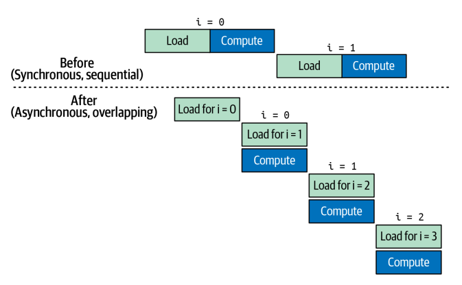
</Frame>


`cudaMemcpyAsync` 可以实现和 kernel 重叠。要真正重叠，通常需要：
- 使用正确的 CUDA stream。
- 避免 default stream 隐式同步。
- 使用 pinned memory，也就是 page-locked host memory。


Profiling 流程：
1. 先用 Nsight Systems 看整体时间线，确认 GPU 是否被喂饱。
2. 再用 Nsight Compute 看最慢 kernel 的细节。
3. 用 Roofline 判断是 memory-bound 还是 compute-bound。
4. 根据瓶颈做针对性优化。
5. 优化后再次 profiling，确认 stall 是否真正减少。


高性能 CUDA 编程不是单纯追求某一个指标，而是在并行度、资源占用、内存层级和实际吞吐之间找平衡。先保证程序正确，再通过 Roofline、Nsight Compute、Nsight Systems 和 NVTX 找到瓶颈，最后用 profiling 验证每一次优化是否真正有效。

## 核心要点

核心结论可以收束为以下几个关键点。

第一，GPU 使用 SIMT 执行模型。线程以 warp 为单位执行，一个 warp 通常包含 32 个线程。高 occupancy 的意义是让 SM 中有足够多的活跃 warp，用于隐藏内存访问和流水线延迟。

第二，CUDA 的线程层级是 thread、block、grid。block 内线程可以通过 `__syncthreads()` 或 cooperative groups 做同步，从而配合 shared memory 实现数据复用。但同步不是免费的，barrier 太多会增加等待开销，因此应避免不必要的同步。

第三，启动参数要兼顾并行度和资源限制。`threadsPerBlock` 通常选择 32 的倍数，以避免 warp 填不满。实践中可以从 `threadsPerBlock = 256` 开始，再根据 profiling 结果调整。`blocksPerGrid = (N + threadsPerBlock - 1) / threadsPerBlock` 用于覆盖全部输入元素。

第四，occupancy 受资源限制影响。每个线程使用的 register、每个 block 使用的 shared memory、SM 最大 resident warp 数和 resident block 数，都会限制同一时刻能驻留的线程数量。Blackwell 相关限制包括每线程最多 255 个 register、每 SM shared memory 上限约 228 KB、最大 resident warp 数 64、最大 resident thread block 数 32。

第五，异步内存管理可以减少同步和分配开销。建议使用 `cudaMallocAsync`、`cudaFreeAsync` 和 CUDA memory pool，避免频繁 `cudaMalloc()` / `cudaFree()` 带来的全局同步和操作系统级开销。PyTorch 的 caching allocator 与这个思路类似，都会复用已申请的显存。

第六，GPU 内存层级决定了数据移动成本。register、shared memory / L1、L2、global memory / HBM、host memory 的容量、延迟和带宽不同。性能优化的关键是尽量让数据在更靠近计算单元的位置被复用，减少反复访问 HBM。

第七，Unified Memory 简化编程，但可能带来 page migration。使用 `cudaMallocManaged()` 后，CPU 和 GPU 可以共享统一地址空间，但数据页可能在 CPU 和 GPU 之间迁移。如果迁移发生在 kernel 执行过程中，就会造成隐藏停顿。可以通过 `cudaMemPrefetchAsync` 和 memory advice 来提前控制数据位置。

第八，Roofline 模型用于判断优化方向。arithmetic intensity 决定 kernel 更接近 memory-bound 还是 compute-bound。对于 memory-bound 场景，可以通过低精度、压缩、提高数据复用、改善访存模式等方式减少数据移动。TMEM 与 Blackwell 的统一矩阵乘加（UMMA）也是改善矩阵计算中的数据供给路径。


## FAQ

{/* 在此添加常见问题 */}
