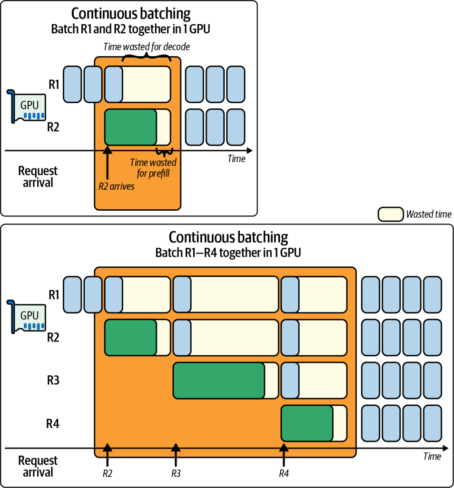
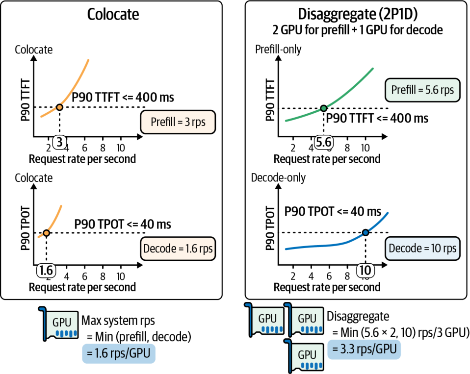
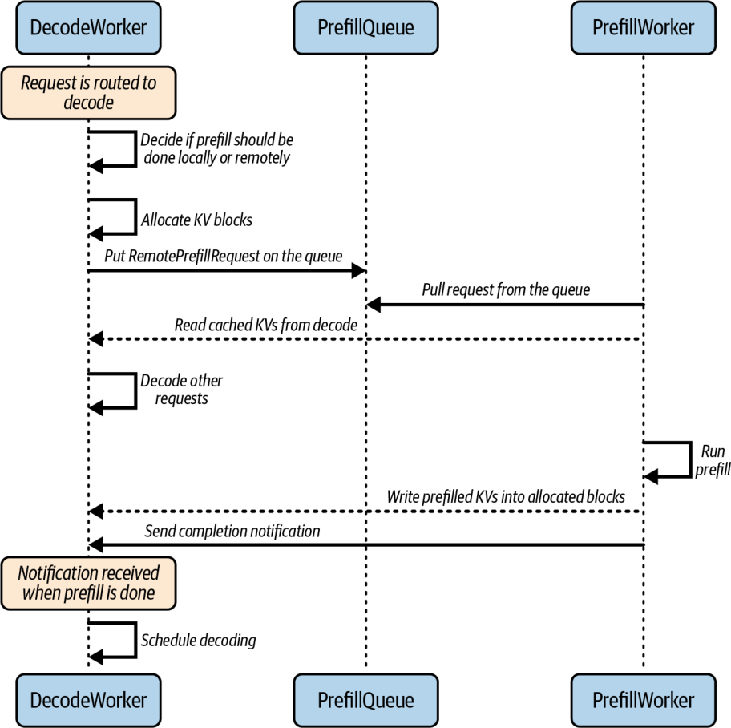
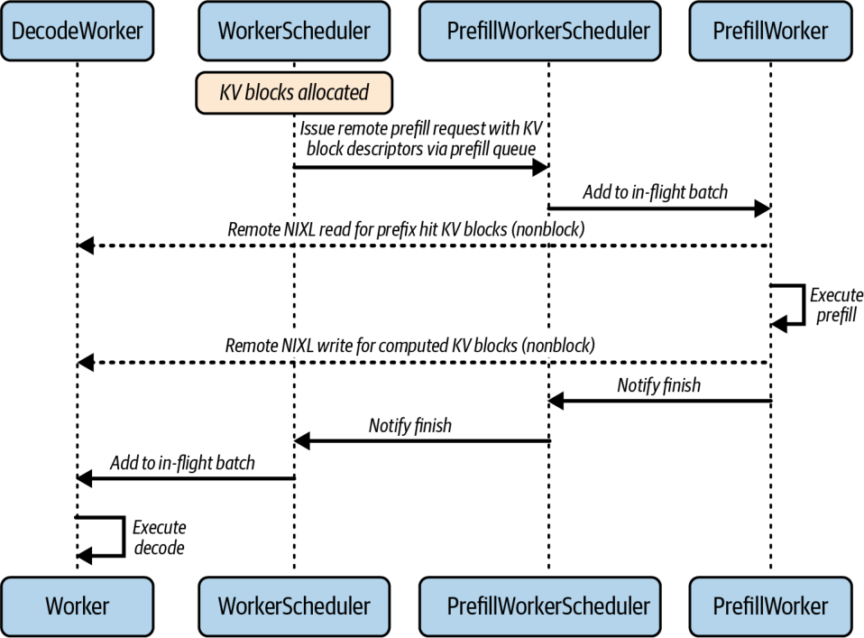
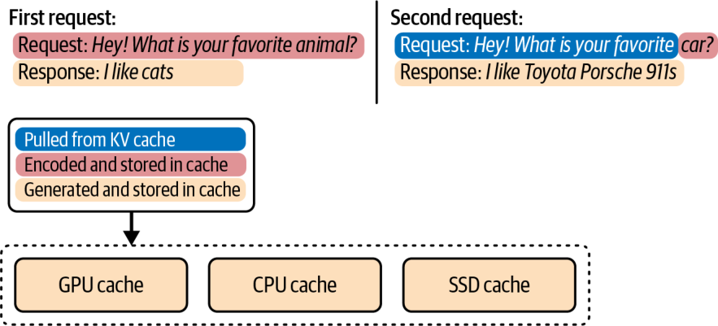
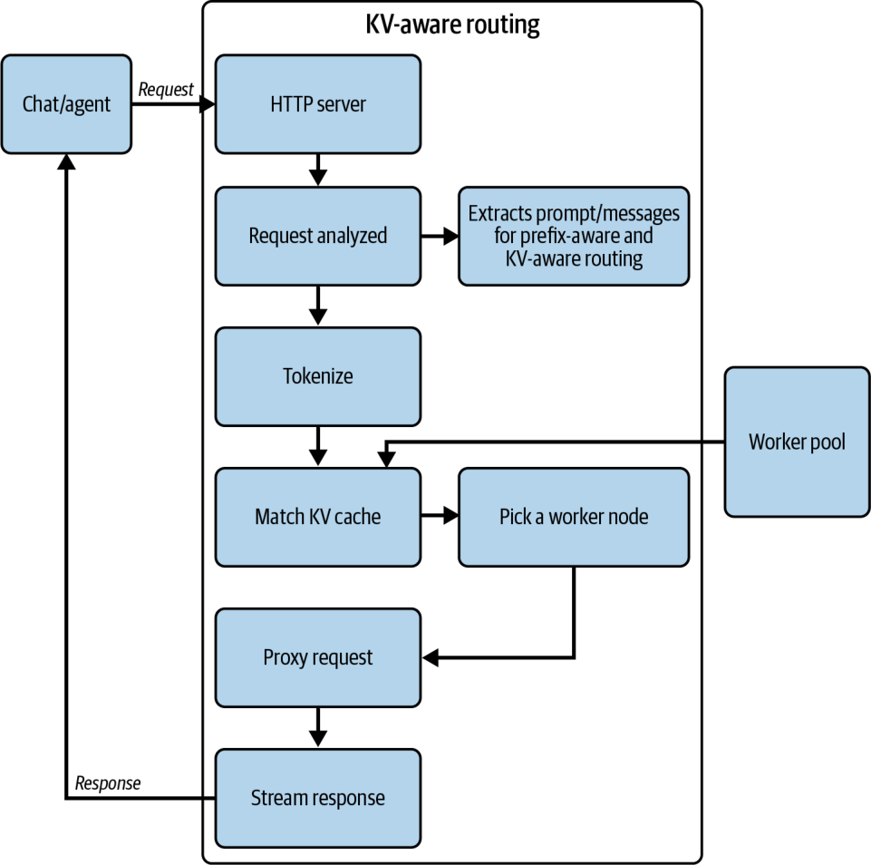
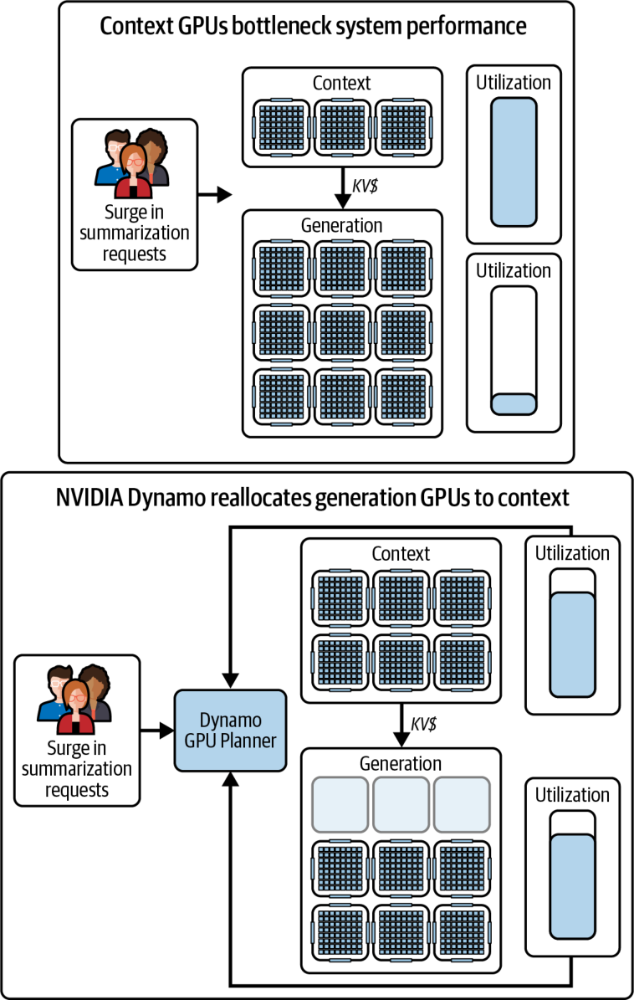

## 本章概要

Prefill/Decode 分离把提示词计算与逐 token 生成放到独立资源池中，使 TTFT 与 TPOT 可以分别优化。它的主要收益来自隔离阶段干扰，而不是减少模型计算量；系统同时新增 KV Cache 传输、双池排队、容量失衡和故障恢复成本。只有当延迟约束下的有效吞吐量（goodput）或单位成本收益能够覆盖这些开销时，分离才优于共置部署。

本章聚焦分离系统的工程路径。Prefill、Decode 与 KV Cache 的基础机制见[第十五章：超大规模 AI 推理系统优化](/books/ai-systems-performance-engineering/chapters/ch15)，框架配置与更多项目对比见[06 - PD 分离](/talks/06-disaggregating-prefill-and-decoding)。

## 章节详解

### 阶段特征与优化目标

LLM 推理包含两个执行形态不同的阶段：

| 维度         | Prefill                        | Decode                                                  |
| ------------ | ------------------------------ | ------------------------------------------------------- |
| 输入         | 完整 prompt                    | 上一步 token 与已有 KV Cache                            |
| 计算形态     | 多个 token 并行通过模型        | 自回归地逐步生成 token                                  |
| 常见瓶颈     | 大矩阵乘法，通常更接近计算受限 | 权重与 KV Cache 读取，通常更接近内存带宽受限            |
| 主要服务指标 | TTFT（Time to First Token）    | TPOT/ITL（Time per Output Token / Inter-Token Latency） |
| 容量驱动因素 | 输入 token 到达率、prompt 长度 | 活跃序列数、输出 token 速率、上下文长度                 |

“计算受限”和“内存带宽受限”是常见工作区间，不是固定属性。短 prompt、小 batch、量化、Attention 实现和并行配置都可能改变瓶颈，部署前仍需用 profile 结果确认。

共置引擎在同一组 GPU 上交替执行两个阶段。连续批处理能提高设备利用率，但长 Prefill 仍可能占用较长的执行片段，使已有 Decode 请求的 TPOT 上升；若调度器持续优先 Decode，新请求的 TTFT 又会增加。这种竞争称为 **Prefill-Decode interference**。



_原书图 17-1。长 Prefill 占用共置 GPU 后，后续 Decode 迭代被推迟。_

分离部署建立独立的 Prefill Pool 与 Decode Pool：Prefill Worker 计算 prompt 并生成 KV Cache，随后把 KV 状态交给 Decode Worker；Decode Worker 继续生成，不再与新的长 Prefill 共享同一执行队列。



_原书图 17-2，数据来自 [DistServe](https://arxiv.org/abs/2401.09670)。论文在其模型、硬件、请求分布和 SLO 下报告最高 7.4× goodput；该结果不代表通用吞吐提升。_

图中的共置配置在 P90 TTFT 约束下可达到 3 requests/s，在 P90 TPOT 约束下只能达到 1.6 requests/s，因此同时满足两项约束的 goodput 是 1.6 requests/s/GPU。2P1D 配置的 Prefill 容量为 $2\times5.6=11.2$ requests/s，Decode 容量为 10 requests/s；三块 GPU 的系统容量取两者较小值，再除以 GPU 数，得到约 $10/3=3.3$ requests/s/GPU。这一比较说明 goodput 由最先触及 SLO 的阶段决定，也说明分离方案必须把额外 GPU 计入成本。

这里需要区分原始吞吐与 goodput。vLLM 的[分离式 Prefill 文档](https://docs.vllm.ai/en/latest/features/disagg_prefill/)明确说明，该实验性功能用于分别调节 TTFT 与 ITL、控制尾部 ITL，不用于提高原始吞吐。DistServe 报告的提升是满足 TTFT、TPOT 和 SLO attainment 后的每 GPU goodput；两者并不矛盾。

分离带来三类能力：

- 两个资源池独立排队，长 Prefill 不再直接阻塞 Decode 迭代；
- Prefill 与 Decode 可以采用不同的 batch、并行度、精度和 GPU 型号；
- 两侧可以按照输入 token 与输出 token 的实际需求分别扩缩容。

它也带来三类固定成本：两个资源池需要独立的模型副本或模型并行组、KV Cache 必须跨进程或跨节点传输、控制面必须协调 Worker 选择与状态交接。低并发、短 prompt 或网络较慢时，共置执行配合 Chunked Prefill 往往更简单，也可能更高效。

### 请求与状态路径

图 17-3 展示一种以 Decode Worker 为请求入口的 decode-centric 路径。其他系统也可以由独立 Frontend 同时选择 Prefill 与 Decode Worker；两种形式的数据依赖相同，但控制面归属不同。decode-centric 路径包含以下阶段：

1. Router 选择 Decode Worker，并为请求建立会话状态；
2. 调度器根据有效 Prefill 长度、缓存局部性与两侧负载，选择本地或远程 Prefill；
3. Decode Worker 预留目标 KV 块，向 Prefill Pool 提交任务与目标描述符；
4. Prefill Worker 计算未命中的 prompt token，并把 KV 块传到目标位置；
5. 完成信号到达 Decode Worker，请求加入下一轮连续批处理；
6. Decode Worker 流式输出 token，结束后释放或保留可复用的 KV 块。



_原书图 17-3。Prefill Worker 可以先读取共享前缀，再只计算缓存未命中的 token。_

控制面只传递请求元数据、块标识、内存描述符与完成事件；数据面负责大体积 KV 张量。将两条路径分开，可以避免 Router 成为 KV 数据的中转瓶颈。跨节点部署通常使用预注册内存和 RDMA 类传输，减少 CPU staging 与重复注册开销；具体可用路径取决于 GPU、NIC、驱动、容器权限和传输库。



_原书图 17-4。NVIDIA [NIXL](https://github.com/ai-dynamo/nixl) 提供面向加速器内存、主机内存与存储的数据移动抽象；vLLM 的[分离式 Prefill 文档](https://docs.vllm.ai/en/latest/features/disagg_prefill/)列出了其连接器与部署限制。_

#### KV Cache 传输预算

常规 Transformer 每个 token 的 KV Cache 理论大小为：

$$
B_{token}=2L H_{kv}D_h B_e
$$

其中 $L$ 是层数，$H_{kv}$ 是 KV Head 数，$D_h$ 是 Head Dimension，$B_e$ 是每个元素的字节数；系数 2 对应 Key 与 Value。传输总量还取决于未命中 token 数 $T_{miss}$：

$$
B_{handoff}=T_{miss}B_{token}
$$

例如，40 层、8 个 KV Head、Head Dimension 为 128、FP16 KV 的模型，每 token 需要：

$$
2\times40\times8\times128\times2=163{,}840\ \text{bytes}
$$

4,096 个 token 对应约 640 MiB。若有效传输带宽为 50 GiB/s，只计算线速下限也需要约 12.5 ms；排队、同步、布局转换和小块传输会继续增加端到端 Handoff 延迟。该估算说明，远程 Prefill 的收益必须大于传输与等待成本。

GQA、MQA 与 MLA 通过减少 KV Head 或压缩潜在表示降低状态大小；FP8 KV 也可近似把相同布局的字节数减半。实际占用还包含块粒度、对齐、元数据和分配器内部碎片，应以引擎指标为准。

#### 块布局与并行布局

Prefill 与 Decode 采用相同 KV 布局时，接收端可以直接消费传来的块。两侧 TP 度、Head 切分或块大小不同时，需要在发送端重排、接收端转换，或让传输层执行多对多映射。布局转换增加显存读写和同步，不能默认视为零成本。

生产系统通常采用以下策略：

- 预注册一组稳定的接收窗口，避免每个请求重复注册显存；
- 合并相邻小块，减少控制消息和网络事务数量；
- 把传输放到独立 Stream，与其他请求的计算重叠；
- 通过完成事件保证 Decode 不会读取尚未到达的块；
- 在 Worker 失败或超时后回收预留块，防止 KV 空间泄漏。

块越大，传输效率通常越高，但内部碎片、取消请求时的浪费与首块可用时间也会增加。块大小需要结合模型 KV 字节数、网络消息效率和引擎分页粒度测量。

### Prefill Pool

Prefill Pool 的目标是在 TTFT 预算内处理输入 token，并尽快释放临时激活与工作区。模型权重常驻显存，生成的 KV Cache 通常在交接后释放；因此，其容量首先受输入 token 到达率和单 token Prefill 成本约束。

用时间窗口 $W$ 内的请求表示需求，Prefill token 到达率可写为：

$$
\lambda_P=\frac{\sum_i T_{miss,i}}{W}
$$

若单个 Prefill 副本在目标 TTFT 下可持续处理 $C_P$ token/s，初始副本数估算为：

$$
N_P\ge\left\lceil\frac{\lambda_P}{C_P\rho_P}\right\rceil
$$

$\rho_P$ 是为了吸收突发与性能方差而保留的目标利用率，通常小于 1。容量测试必须使用真实 prompt 长度分布与前缀命中率；仅用平均长度会低估长尾请求造成的排队。

Prefill 调度常见的两个工作点是：

- 延迟优先：请求到达后尽快执行，小 batch 降低排队时间，但设备利用率较低；
- 吞吐优先：设置短 batching window 聚合更多 token，提高矩阵计算效率，但把等待时间计入 TTFT。

批处理预算更适合按 token 而非请求数控制。两个各含 256 token 的请求与两个各含 32K token 的请求，对显存、执行时间和 Handoff 的影响完全不同。长度分桶或 token budget 可以减小同批请求的方差。

#### 长 Prompt

单个超长 prompt 仍可能占满 Prefill Worker。可选手段包括 Chunked Prefill、Context Parallelism 或为超长请求设置独立队列：

| 手段                | 直接作用                              | 主要代价                           |
| ------------------- | ------------------------------------- | ---------------------------------- |
| Chunked Prefill     | 把长 prompt 切成多个调度片段          | 增加调度次数，仍与同池任务共享资源 |
| Context Parallelism | 把序列状态与 Attention 计算分布到多卡 | 新增跨卡通信与布局约束             |
| 独立长请求队列      | 隔离长尾输入                          | 需要单独容量，空闲时可能浪费资源   |

当 prompt 已有大比例前缀命中时，应按 $T_{miss}$ 而非原始 prompt 长度判断是否远程执行。将已经存在于 Decode Worker 的大量 KV 数据重新搬运到 Prefill Worker，再传回 Decode，可能比本地补算少量 token 更慢。

### 硬件与并行配置

分离允许两个资源池独立选择硬件和并行配置，但“Prefill 使用算力型 GPU、Decode 使用带宽型 GPU”只能作为选型起点。现代 GPU 的计算吞吐、HBM 带宽与容量通常同时增长，异构部署还会增加镜像、Kernel、量化格式和备件管理成本。最终配置需要比较每个阶段在目标 SLO 下的单位成本，而不是按硬件标签直接分配。

Prefill 常通过更大的 token batch 提高矩阵乘法效率。模型无法装入单卡或单请求 TTFT 要求更低时，可以增加 Tensor Parallelism；超长上下文还可能采用 Context Parallelism。并行度增加会缩短部分计算，却引入集合通信，因此最优值受 GPU 拓扑、模型形状与 batch 影响。

Decode 的每次迭代计算量较小，频繁的跨卡同步可能直接进入 TPOT 关键路径。能够在较低并行度下容纳模型时，减少 Tensor Parallelism 有时更高效；模型容量、MoE Expert Parallelism 或单卡 HBM 不足时仍需多卡。将“Decode 固定使用 TP=1”作为通用规则并不成立。

异构资源池还要验证以下兼容条件：

- 两侧模型权重、Tokenizer、位置编码和 KV dtype 完全一致；
- Prefill 输出的 KV 布局可以由 Decode 直接读取，或存在经过测量的转换路径；
- 两类 GPU 都支持所选量化格式、Attention Kernel 和通信后端；
- 调度器不会把只能由某类 GPU 处理的请求发送到不兼容实例；
- 降级路径在其中一类资源耗尽时仍能提供服务。

网络拓扑也属于放置策略。高频集合通信应尽量留在 NVLink/NVSwitch 等高速域内，跨节点链路主要承担 KV Handoff。即使链路峰值带宽足够，Prefill 与 Decode 跨越多个交换层级也会增加拥塞与尾延迟；容量测试需要覆盖实际机架和 NUMA/NIC 亲和性，而非只测试同机路径。

### Decode Pool

Decode Pool 持有模型权重与活跃请求的 KV Cache，并执行连续批处理。它的容量由输出 token 速率、活跃序列数、TPOT SLO、上下文长度和可用 KV 空间共同决定。



_原书图 17-5。第二个请求复用第一个请求已经生成的前缀 KV；KV 状态可以位于 GPU、CPU 或 SSD 层级。分层存储是否更快取决于命中位置、读取带宽与避免重算的时间。_

Decode 侧通常使用分页 KV 分配器管理不同长度的序列。固定大小的逻辑块通过块表映射到非连续物理块，减少为最大序列长度预留连续显存造成的浪费。vLLM 的 [PagedAttention 设计文档](https://docs.vllm.ai/en/latest/design/paged_attention/)说明了其块表与内核寻址方式。分页管理解决的是设备内分配问题；图 17-5 展示的多级缓存解决的是跨介质容量与复用问题，两者可以组合，但并非同一机制。

每次 Decode 迭代从就绪请求中各推进一个或多个 token。请求完成后立即退出批次，新完成 Prefill 的请求在后续迭代加入。连续批处理避免静态 batch 等待最慢序列，但 batch 增大后单次迭代时间也会上升；TPOT SLO 决定可接受的最大 token budget。

Decode Worker 需要持续观测：

- 活跃序列数与等待序列数；
- 每轮调度的 token 数与迭代耗时；
- KV Cache 使用率、分配失败与换入换出字节数；
- TPOT 的 p50、p95、p99 与不同上下文长度分桶；
- Handoff 到达率与等待可用 KV 的请求数。

当 KV Cache 接近满载时，新请求即使有算力也无法进入 Decode。扩容信号应同时包含 KV 使用率、活跃 token 数和 TPOT，不能只依赖 GPU Core 利用率。把 KV 卸载到主机内存或 NVMe 会扩大容量，但每次重新取回状态都可能进入 token 生成的关键路径；[LMCache](https://docs.lmcache.ai/) 等系统把外部 KV 层级和连接器纳入运行时，是否获益取决于命中率、介质带宽和预取效果。

### 缓存感知路由

轮询只均衡请求数量，无法反映请求成本和缓存位置。分离式 Router 至少需要回答两个问题：

1. 哪个 Decode Worker 最适合持有该请求？
2. Prefill 应在该 Decode Worker 本地执行，还是发送到 Prefill Pool？



_原书图 17-6。Router 通过 Worker 发出的缓存事件维护近似索引；控制面视图存在传播延迟，因此仍需处理缓存已被淘汰的情况。_

#### 本地与远程 Prefill 的成本

对候选路径建立延迟估计比固定 prompt 阈值更稳定：

$$
T_{local}=Q_D+C_{P,local}(T_{miss})+C_{D,interference}
$$

$$
T_{remote}=Q_P+C_{P,remote}(T_{miss})+T_{handoff}+T_{sync}
$$

$Q_D$ 与 $Q_P$ 分别是本地 Decode 队列和 Prefill Pool 的预计等待时间；$C_{D,interference}$ 表示本地 Prefill 对活跃 Decode 的影响。只有当远程路径满足 TTFT 预算，并且其综合代价低于本地路径时才应卸载。

估计模型通常使用以下输入：

| 信号                      | 路由含义                                |
| ------------------------- | --------------------------------------- |
| 缓存未命中 token 数       | 决定剩余 Prefill 计算和新增 KV 字节数   |
| Prefix Cache 位置         | 优先复用已有状态，减少计算与传输        |
| Prefill 队列 token 数     | 估算远程路径排队时间                    |
| Decode 活跃 token 与 TPOT | 估算本地 Prefill 的干扰成本             |
| Decode KV 使用率          | 避免把请求送到即将发生驱逐或 OOM 的实例 |
| 网络与 Handoff 遥测       | 估算数据面传输和同步时间                |
| 请求优先级与 deadline     | 约束候选路径和准入策略                  |

一个简化决策器可以直接比较两条路径的预测时间：

```python
from dataclasses import dataclass


@dataclass
class RouteEstimate:
    local_ms: float
    remote_ms: float
    remote_ttft_ms: float


def use_remote_prefill(estimate: RouteEstimate, ttft_slo_ms: float) -> bool:
    remote_meets_slo = estimate.remote_ttft_ms <= ttft_slo_ms
    return remote_meets_slo and estimate.remote_ms < estimate.local_ms
```

这段代码只展示决策边界，不是某个框架的真实配置。生产模型还应输出置信区间，并在样本不足、指标过期或 Prefill Pool 故障时回退到保守路径。阈值应通过回放真实流量或在线小比例实验校准，不能从其他 GPU、模型或请求分布直接复制。

#### 缓存局部性与负载均衡

缓存命中和负载均衡可能给出相反选择：持有最长前缀的 Worker 也可能是最繁忙的 Worker。Router 应比较“复用已有 KV 节省的时间”与“进入繁忙 Worker 增加的排队时间”，而不是绝对优先某一项。

缓存索引还需要明确一致性边界。Worker 驱逐 KV 块后，事件到达 Router 前存在短暂窗口；路由请求时应由目标 Worker 再次确认命中，未命中则重新计算或从外部层级读取。把缓存索引当成强一致元数据会放大控制面开销，也会使路由依赖中心服务的可用性。

### 双池容量与自动扩缩

把 Prefill、Decode 与传输能力按同一请求长度分布折算为 requests/s 后，分离系统的服务率由较慢的一侧限制：

$$
R_{system}=\min(R_P,R_D,R_{handoff})
$$

增加 Prefill Worker 只会提高 $R_P$；若 Decode 或网络已经饱和，系统 goodput 不会继续增长。相反，扩容 Decode 也不能消除 Prefill 排队。自动扩缩需要同时观察两侧队列和 Handoff 通道。



_原书图 17-7。输入长、输出短的摘要流量通常增加 Prefill 压力；输入短、输出长的推理或生成流量通常增加 Decode 压力。_

扩缩容存在模型加载与缓存预热时间。新增 Decode Worker 在权重加载完成后仍是冷缓存，立即分配大量请求可能降低命中率并造成短时尾延迟。缩容前则需停止接收新请求，等待现有序列结束，或把 KV 状态迁移到其他 Worker。直接终止实例会中断流式生成。

适合驱动扩缩容的指标包括：

| 资源池  | 扩容信号                                       | 缩容前检查                 |
| ------- | ---------------------------------------------- | -------------------------- |
| Prefill | 等待 token 数、预测 TTFT、输入 token/s         | 队列稳定下降，保留突发余量 |
| Decode  | 活跃 token、KV 使用率、预测 TPOT、输出 token/s | 活跃序列排空或可迁移       |
| 传输层  | Handoff 带宽、排队字节、完成延迟               | 确认网络不是隐藏瓶颈       |

若 GPU 角色可以动态切换，Planner 仍需支付卸载旧模型状态、加载新角色配置和预热内核的成本。切换频率过高会产生振荡。常用控制手段包括上下阈值分离、最短驻留时间、冷却窗口和基于预测需求的提前扩容。

### QoS 与准入控制

分离减少阶段干扰，但不会消除过载。当任一资源池的到达率长期高于服务率，队列仍会无限增长。此时继续接收请求会让更多请求同时违反 SLO。

准入控制应在分配大量 KV 空间或启动远程 Prefill 前估计完成风险：

$$
T_{predicted}=T_{queue}+T_{prefill}+T_{handoff}+T_{first\ decode}
$$

若 $T_{predicted}$ 已超过请求 deadline，可以拒绝、排入低优先级队列，或在产品允许时降级。降级策略可能包括限制最大输出长度、切换较小模型、降低低优先级请求的并发配额。截断用户输入会改变语义，不应作为无提示的基础设施优化。

优先级调度必须防止低优先级长期饥饿。可采用每类独立 token budget、老化机制或加权公平队列。流式请求一旦开始 Decode，频繁抢占会导致 KV Cache 保留、恢复和连接管理成本；因此通常在准入和 Prefill 排队阶段做优先级控制更便宜。

### 故障与回退

分离系统比共置系统多出一次跨 Worker 状态交接，故障处理需要覆盖以下场景：

- Prefill Worker 在计算中失败：任务可以在其他 Prefill Worker 重试；
- KV 只传输了一部分：Decode Worker 必须丢弃不完整块并释放预留空间；
- 完成通知丢失：通过超时和幂等任务 ID 查询或重试，避免重复块泄漏；
- Decode Worker 失败：如果没有外部 KV 副本，请求通常需要重新 Prefill；
- Router 缓存视图过期：目标 Worker 再次确认命中，并返回可重试状态；
- 传输层退化：关闭远程 Prefill，让 Decode Worker 暂时执行本地 Prefill。

幂等性需要覆盖“任务已完成但确认丢失”的情况。相同任务 ID 的重试不能重复提交输出 token，也不能把同一 KV 块计入两次引用。控制面不可用时，本地 Prefill 回退可以保住服务，但会重新引入阶段干扰；监控应明确标记回退流量，避免把 TPOT 回归误判为模型性能变化。

### 性能验证

分离部署不能只比较 tokens/s。测试合同至少包含模型与精度、并行配置、硬件与网络拓扑、prompt/output 长度联合分布、前缀复用率、请求到达过程、TTFT/TPOT SLO 和目标达标率。

建议比较三组基线：

1. 共置连续批处理；
2. 共置连续批处理加 Chunked Prefill；
3. Prefill/Decode 分离。

三组配置使用相同 GPU 总数、模型、数据集和请求到达轨迹。结果至少报告：

| 类别     | 指标                                             |
| -------- | ------------------------------------------------ |
| 用户体验 | TTFT、TPOT/ITL、端到端延迟的 p50/p95/p99         |
| 服务能力 | SLO attainment、goodput、拒绝率                  |
| 资源     | GPU 数、功耗、HBM、网络带宽、CPU 与固定内存      |
| 数据路径 | Handoff 字节数、有效带宽、完成延迟、布局转换耗时 |
| 缓存     | Prefix 命中 token 比例、驱逐率、外部层级命中率   |
| 稳定性   | Worker 故障恢复时间、回退率、扩缩容收敛时间      |

Goodput 应按请求是否同时满足全部服务条件计算。例如，一个请求 TTFT 达标但 TPOT 超标，不能计入完整的 SLO goodput。若不同用户层级使用不同 SLO，需要分别报告，避免聚合平均值掩盖低优先级或长上下文请求的退化。

Profile 时应把请求 ID 贯穿 Router、Prefill、Handoff 与 Decode，并在同一时间轴中关联 GPU Kernel、CUDA Stream、网络传输和队列事件。关键检查项包括：

- 传输是否与其他请求计算重叠；
- Decode 是否因等待完成事件形成气泡；
- 实际网络带宽是否接近消息大小对应的可达区间；
- 布局转换是否进入关键路径；
- 长 prompt 或高缓存命中请求是否被错误路由；
- P99 是否由少数 Worker、网络链路或冷缓存实例主导。

### 选型边界

| 条件   | 更适合分离                               | 更适合共置或 Chunked Prefill     |
| ------ | ---------------------------------------- | -------------------------------- |
| SLO    | TTFT 与 TPOT 都严格，且阶段干扰明显      | 延迟目标宽松或只关注总吞吐       |
| 流量   | 并发高、输入输出比例变化大               | 低并发、流量规模较小             |
| Prompt | 长度方差大，存在长 prompt                | prompt 普遍短且稳定              |
| 网络   | KV Handoff 有高带宽、低延迟路径          | 跨节点带宽不足或拥塞不可控       |
| 集群   | 规模足以独立配置两类资源池               | GPU 数少，拆池后容易形成闲置碎片 |
| 运维   | 具备端到端 tracing、缓存索引和双池控制面 | 希望保持简单故障域与调度路径     |

分离也不要求所有请求都走远程 Prefill。混合模式通常更合理：缓存命中高、prompt 短或 Prefill Pool 饱和时执行本地 Prefill；长 prompt 且远程路径可在 deadline 内完成时卸载。路由器的职责是为每个请求选择成本更低的路径，而不是维持固定的架构标签。

## 核心结论

- PD 分离通过隔离阶段队列来改善 TTFT 与 TPOT 的可控性，不会减少模型本身所需的计算。
- KV Cache Handoff 是新增关键路径。状态大小、有效带宽、块粒度、布局转换和同步共同决定分离是否划算。
- Prefill Pool 按未命中输入 token 规划容量；Decode Pool 按活跃 token、输出速率、KV 容量和 TPOT 规划容量。
- Router 需要同时考虑缓存局部性与排队成本。固定 prompt 长度阈值只能作为冷启动策略。
- 系统吞吐受 Prefill、Decode 和 Handoff 三者中的最小容量限制；单侧扩容不能修复另一侧瓶颈。
- 过载时需要准入控制和明确的降级策略。分离本身不能兑现超出集群容量的 SLO。
- 最终判断依据是相同资源预算下的 goodput、尾延迟和成本，而不是峰值 tokens/s。

## FAQ

### GPU 利用率

分离不会保证 GPU 利用率提高。资源隔离可能让两个资源池更容易针对阶段特征调优，也可能因负载比例变化产生一侧空闲。收益应以 SLO 约束下的 goodput 和成本衡量。小集群、低并发或输入输出比例波动很大时，共置池通常具有更好的资源复用率。

### Decode Worker 的 KV 空间预留

Decode 必须持有后续 Attention 使用的历史 KV。提前预留块可以让 Prefill Worker 直接写入确定位置，并在 Handoff 完成后立即进入 Decode；代价是排队或失败期间会暂时占用 KV 容量，因此需要超时回收和幂等引用管理。

### Prefix Cache 命中与 Worker 选择

缓存命中不代表请求一定要发送到缓存所在 Worker。缓存复用节省的计算可能小于繁忙 Worker 新增的排队时间。Router 需要比较剩余计算、缓存搬运、KV 容量和候选 Worker 的预计完成时间。缓存索引还可能过期，目标 Worker 必须能够处理实际未命中。

### 自动扩缩指标

GPU Utilization 无法区分有效计算、等待通信和批次形态，也不反映 KV Cache 是否接近满载。Prefill 应结合等待 token 与预测 TTFT，Decode 应结合活跃 token、KV 使用率与预测 TPOT，传输层还要单独观察排队字节和 Handoff 延迟。

### PD 分离与 Chunked Prefill

两种方案不互斥。Chunked Prefill 控制长 Prefill 的单次调度粒度，PD 分离隔离两类资源池。Prefill Pool 内仍可使用 Chunked Prefill，Decode Worker 的本地回退路径也可使用它。是否组合取决于长 prompt 的占比、调度开销与 TTFT 预算。

## 相关资料

- [DistServe: Disaggregating Prefill and Decoding for Goodput-optimized Large Language Model Serving](https://arxiv.org/abs/2401.09670)：PD 分离的系统设计、放置算法与 goodput 实验。
- [vLLM — Disaggregated Prefilling](https://docs.vllm.ai/en/latest/features/disagg_prefill/)：连接器、部署方式、限制与示例。
- [vLLM — Paged Attention](https://docs.vllm.ai/en/latest/design/paged_attention/)：分页 KV Cache 的块布局与内核设计。
- [NIXL](https://github.com/ai-dynamo/nixl)：面向加速器、主机内存和存储的数据传输抽象。
- [LMCache Documentation](https://docs.lmcache.ai/)：跨 GPU、CPU 与存储层级复用和卸载 KV Cache 的实现资料。
- [Efficient Memory Management for Large Language Model Serving with PagedAttention](https://arxiv.org/abs/2309.06180)：PagedAttention 与 vLLM 的原始论文。
